This document contains visual architecture diagrams in Mermaid format that can be rendered in GitHub, GitLab, or any Mermaid-compatible viewer.

---

## 1. System Architecture - High Level

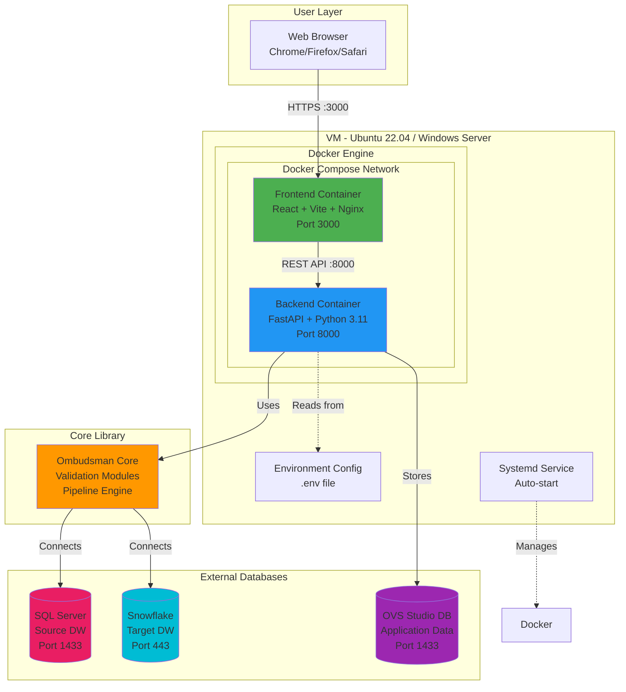

---

## 2. Component Architecture

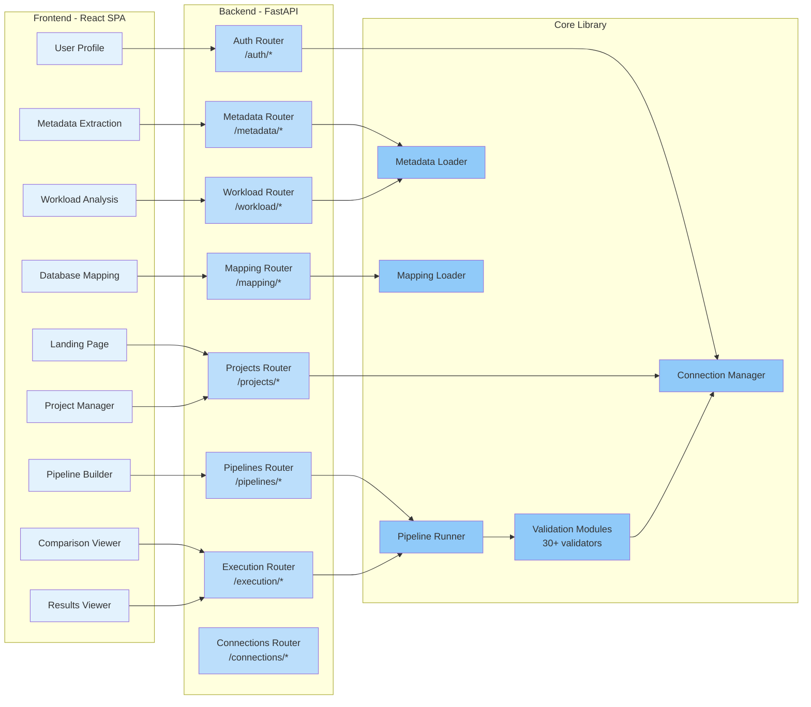

---

## 3. Data Flow - User Authentication

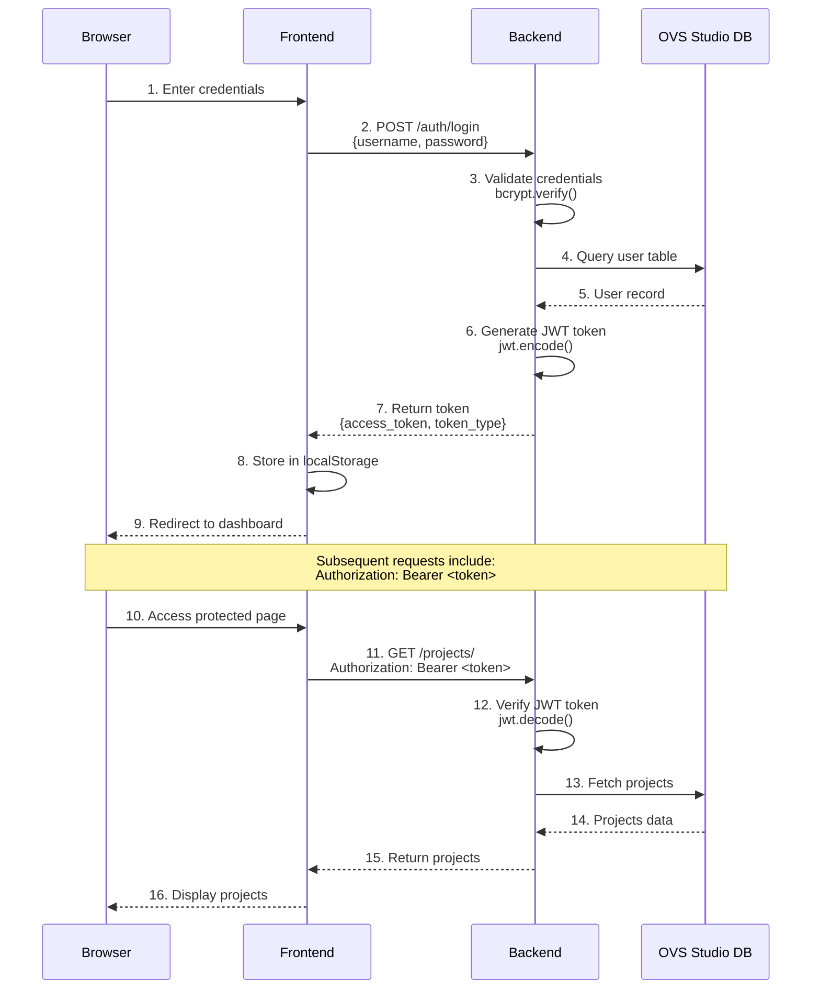

---

## 4. Data Flow - Metadata Extraction

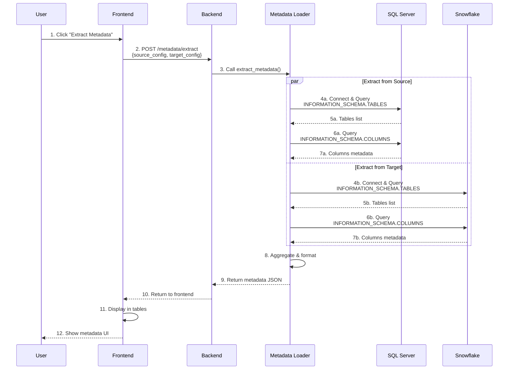

---

## 5. Data Flow - Pipeline Execution

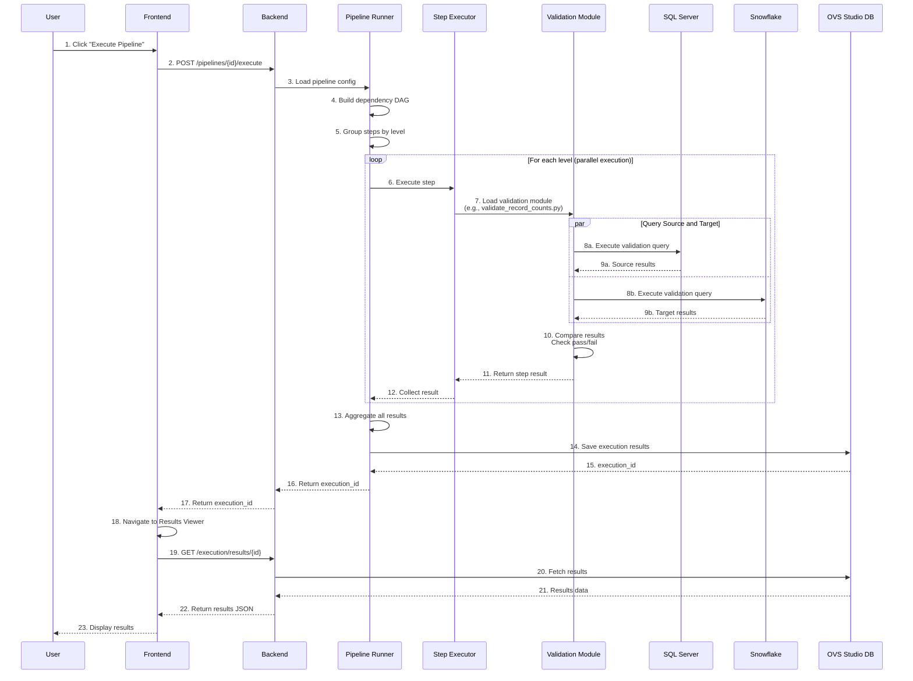

---

## 6. Validation Module Architecture

```mermaid
graph TB
    subgraph "Validation Categories"
        SCHEMA[Schema Validation<br/>3 modules]
        DQ[Data Quality<br/>8 modules]
        RI[Referential Integrity<br/>1 module]
        DIM[Dimension Validation<br/>5 modules]
        FACT[Fact Validation<br/>2 modules]
        METRIC[Metrics Validation<br/>3 modules]
        TS[Time Series<br/>4 modules]
        BIZ[Business Rules<br/>Custom]
    end

    subgraph "Schema Validation"
        S1[validate_schema_columns<br/>Column existence]
        S2[validate_schema_datatypes<br/>Data type matching]
        S3[validate_schema_nullability<br/>NULL constraints]
    end

    subgraph "Data Quality"
        D1[validate_record_counts<br/>Row count comparison]
        D2[validate_nulls<br/>NULL validation]
        D3[validate_uniqueness<br/>Unique constraints]
        D4[validate_statistics<br/>Statistical validation]
        D5[validate_distribution<br/>Distribution analysis]
        D6[validate_outliers<br/>Outlier detection]
        D7[validate_domain_values<br/>Domain validation]
        D8[validate_regex_patterns<br/>Pattern matching]
    end

    subgraph "Referential Integrity"
        R1[validate_foreign_keys<br/>FK constraint validation]
    end

    subgraph "Dimension Validation"
        DM1[validate_dim_business_keys<br/>Business key validation]
        DM2[validate_dim_surrogate_keys<br/>Surrogate key validation]
        DM3[validate_scd1<br/>SCD Type 1]
        DM4[validate_scd2<br/>SCD Type 2]
        DM5[validate_composite_keys<br/>Composite keys]
    end

    subgraph "Fact Validation"
        F1[validate_fact_dim_conformance<br/>Fact-dimension conformance]
        F2[validate_late_arriving_facts<br/>Late arriving facts]
    end

    subgraph "Metrics Validation"
        M1[validate_metric_sums<br/>Sum validation]
        M2[validate_metric_averages<br/>Average validation]
        M3[validate_ratios<br/>Ratio validation]
    end

    subgraph "Time Series"
        T1[validate_ts_continuity<br/>Continuity validation]
        T2[validate_ts_duplicates<br/>Duplicate detection]
        T3[validate_ts_rolling_drift<br/>Drift detection]
        T4[validate_period_over_period<br/>Period comparison]
    end

    SCHEMA --> S1 & S2 & S3
    DQ --> D1 & D2 & D3 & D4 & D5 & D6 & D7 & D8
    RI --> R1
    DIM --> DM1 & DM2 & DM3 & DM4 & DM5
    FACT --> F1 & F2
    METRIC --> M1 & M2 & M3
    TS --> T1 & T2 & T3 & T4

    style SCHEMA fill:#E8F5E9
    style DQ fill:#E3F2FD
    style RI fill:#FFF3E0
    style DIM fill:#F3E5F5
    style FACT fill:#FCE4EC
    style METRIC fill:#E0F2F1
    style TS fill:#FFF9C4
    style BIZ fill:#EFEBE9
```

---

## 7. Security Architecture

```mermaid
graph TB
    subgraph "Security Layers"
        L1[Layer 1: Transport Security<br/>HTTPS/TLS 1.3]
        L2[Layer 2: Authentication<br/>JWT + bcrypt]
        L3[Layer 3: Authorization<br/>RBAC]
        L4[Layer 4: Database Security<br/>Parameterized Queries]
        L5[Layer 5: API Security<br/>CORS + Validation]
        L6[Layer 6: Container Security<br/>Non-root execution]
        L7[Layer 7: Network Security<br/>Firewall + VPN]
    end

    L1 --> L2 --> L3 --> L4 --> L5 --> L6 --> L7

    subgraph "Authentication Flow"
        LOGIN[User Login] --> HASH[Password Hash<br/>bcrypt]
        HASH --> VERIFY{Verify<br/>Password}
        VERIFY -->|Success| JWT[Generate JWT<br/>HS256]
        VERIFY -->|Fail| REJECT[Reject]
        JWT --> TOKEN[Return Token]
        TOKEN --> STORE[Store in<br/>localStorage]
        STORE --> AUTH_REQ[Subsequent Requests<br/>Authorization: Bearer]
        AUTH_REQ --> VALIDATE{Validate<br/>JWT}
        VALIDATE -->|Valid| ALLOW[Allow Access]
        VALIDATE -->|Invalid| DENY[Deny Access]
    end

    subgraph "Secrets Management"
        ENV[.env File<br/>Never commit!]
        SECRET1[SQL Server Password]
        SECRET2[Snowflake Password]
        SECRET3[JWT Secret Key]
        SECRET4[OVS DB Password]

        ENV --> SECRET1 & SECRET2 & SECRET3 & SECRET4
    end

    style L1 fill:#FFEBEE
    style L2 fill:#FCE4EC
    style L3 fill:#F3E5F5
    style L4 fill:#EDE7F6
    style L5 fill:#E8EAF6
    style L6 fill:#E3F2FD
    style L7 fill:#E1F5FE
    style JWT fill:#C8E6C9
    style VERIFY fill:#FFF9C4
    style VALIDATE fill:#FFF9C4
    style ENV fill:#FFCCBC
```

---

## 8. Deployment Architecture - Single VM

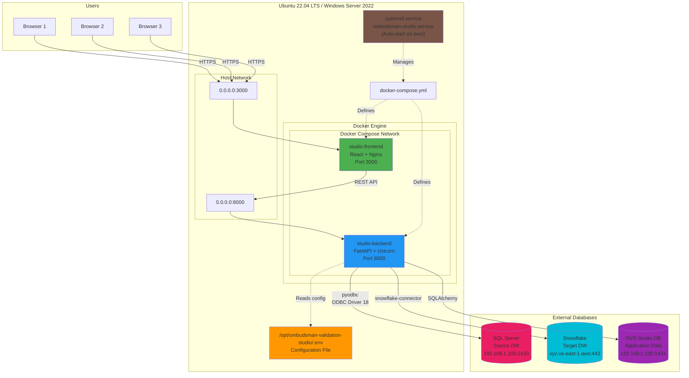

---

## 9. Intelligent Workload Analysis Flow

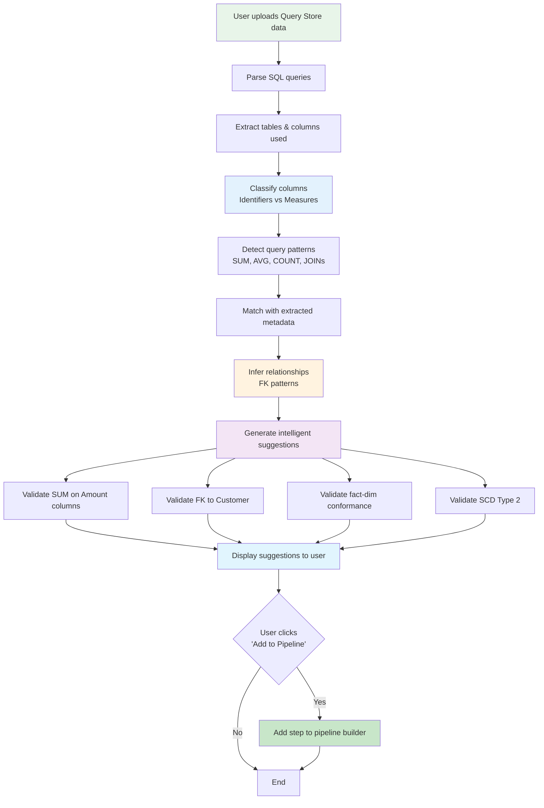

---

## 10. Technology Stack Overview

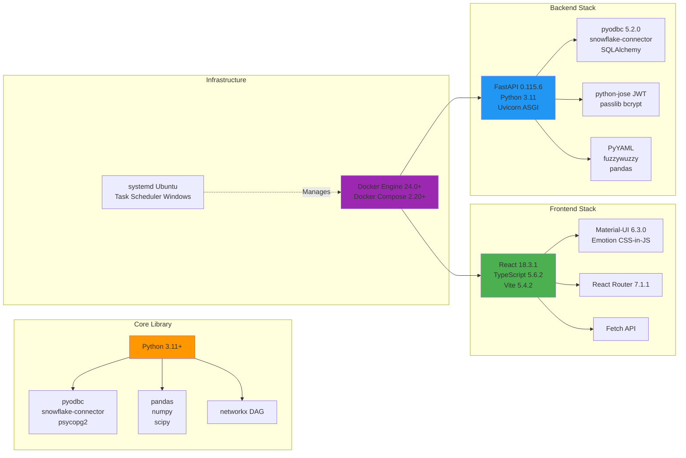

---

## 11. Database Schema - OVS Studio DB

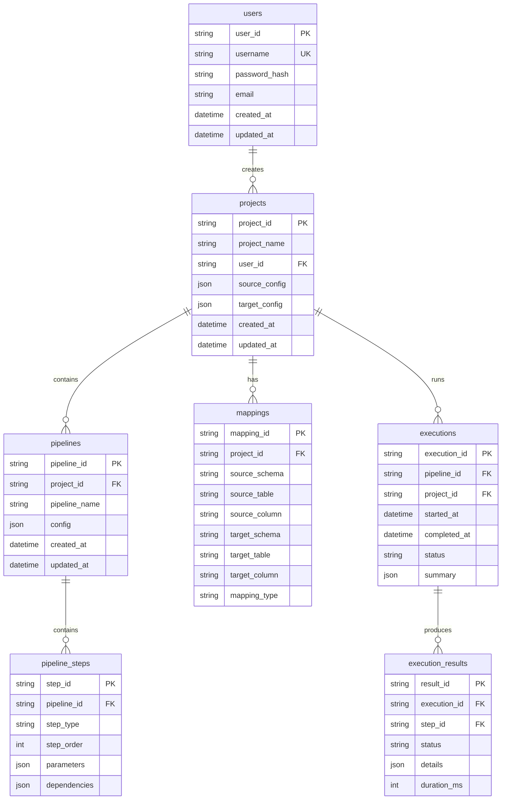

---

## 12. CI/CD Pipeline (Future Enhancement)

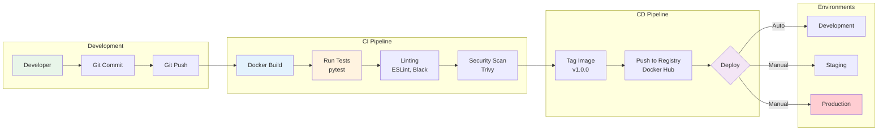

---

## How to View These Diagrams

### Option 1: GitHub/GitLab
Simply view this file in GitHub or GitLab - they render Mermaid diagrams automatically.

### Option 2: VS Code
Install the "Markdown Preview Mermaid Support" extension:
```bash
code --install-extension bierner.markdown-mermaid
```

### Option 3: Online Viewer
Copy any diagram code block to:
- https://mermaid.live/
- https://mermaid-js.github.io/mermaid-live-editor/

### Option 4: CLI Tool
Install mermaid-cli:
```bash
npm install -g @mermaid-js/mermaid-cli
mmdc -i ARCHITECTURE_DIAGRAM.md -o architecture.pdf
```

---

**Document Version**: 1.0
**Last Updated**: 2025-12-15
**Maintained By**: Ombudsman Development Team
