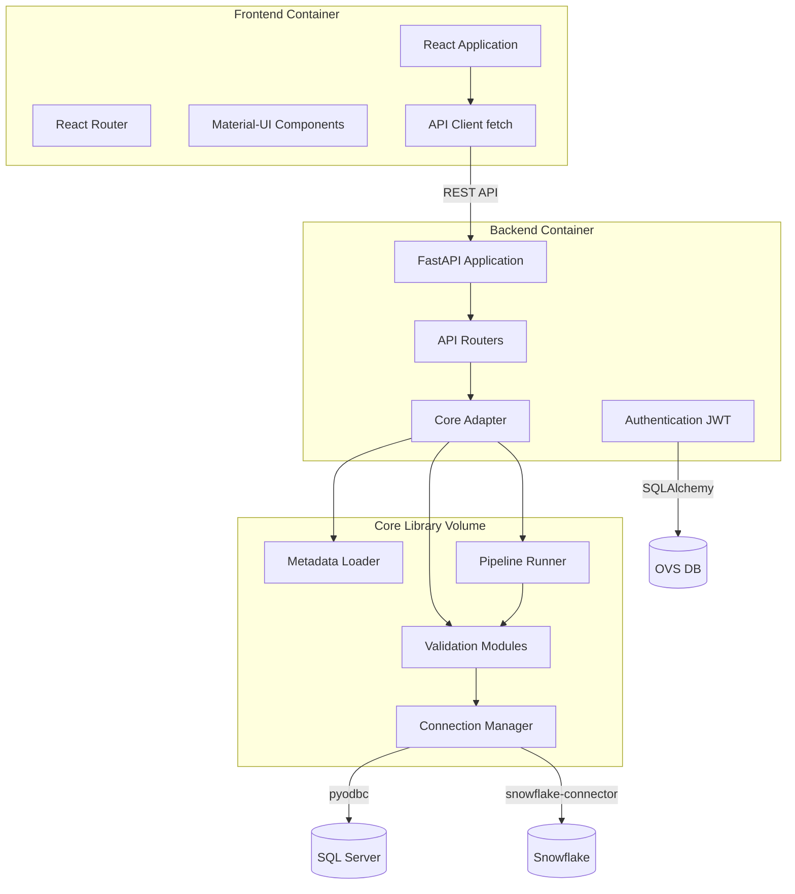

**Version**: 1.0
**Last Updated**: 2025-12-15
**Audience**: Developers, Architects, System Administrators

---

## Table of Contents

1. [Introduction](#introduction)
2. [System Architecture](#system-architecture)
3. [Technology Stack](#technology-stack)
4. [Frontend Implementation](#frontend-implementation)
5. [Backend Implementation](#backend-implementation)
6. [Core Library Implementation](#core-library-implementation)
7. [Database Schema](#database-schema)
8. [API Reference](#api-reference)
9. [Authentication & Security](#authentication--security)
10. [Deployment & Configuration](#deployment--configuration)
11. [Development Guide](#development-guide)
12. [Testing](#testing)
13. [Performance Optimization](#performance-optimization)
14. [Troubleshooting](#troubleshooting)
15. [Extension Guide](#extension-guide)

---

## Introduction

### Purpose of This Manual

This technical manual provides in-depth technical documentation for developers, architects, and administrators working with Ombudsman Validation Studio. It covers:
- How each component is built
- Implementation details
- API specifications
- Development workflows
- Extension points

### System Overview

```
┌─────────────────────────────────────────────────────┐
│                   Ombudsman.AI                      │
│            Validation Studio Platform               │
├─────────────────────────────────────────────────────┤
│                                                     │
│  Frontend (React SPA)  ←→  Backend (FastAPI)       │
│         ↓                         ↓                 │
│    Browser Rendering         Core Library          │
│                                   ↓                 │
│                           Database Connectors       │
│                                   ↓                 │
│                    ┌──────────────┼──────────────┐  │
│                    ↓              ↓              ↓  │
│              SQL Server      Snowflake      OVS DB  │
└─────────────────────────────────────────────────────┘
```

---

## System Architecture

### Component Breakdown

#### 1. Frontend (React SPA)
**Location**: `/ombudsman-validation-studio/frontend/`
**Technology**: React 18 + TypeScript + Material-UI
**Build**: Vite
**Deployment**: Nginx (port 3000)

#### 2. Backend (FastAPI)
**Location**: `/ombudsman-validation-studio/backend/`
**Technology**: FastAPI + Python 3.11
**Deployment**: Uvicorn ASGI (port 8000)

#### 3. Core Library
**Location**: `/ombudsman_core/`
**Technology**: Python 3.11
**Purpose**: Validation engine, metadata extraction, pipeline execution

#### 4. Databases
- **SQL Server**: Source database (customer data warehouse)
- **Snowflake**: Target database (migrated data)
- **OVS Studio DB**: Application database (users, projects, results)

### Architecture Diagram



---

## Technology Stack

### Frontend Stack

```yaml
Core:
  - React: 18.3.1
  - TypeScript: 5.6.2
  - Vite: 5.4.2 (build tool)

UI Framework:
  - Material-UI: 6.3.0
  - MUI Icons: 6.3.0
  - Emotion: CSS-in-JS styling

Routing:
  - React Router: 7.1.1

HTTP Client:
  - Fetch API (native)

State Management:
  - React useState, useContext
  - localStorage for persistence

Development:
  - ESLint: Code linting
  - Vite Dev Server: Hot reload
```

### Backend Stack

```yaml
Core:
  - FastAPI: 0.115.6
  - Python: 3.11
  - Uvicorn: ASGI server
  - Pydantic: Data validation

Database Drivers:
  - pyodbc: 5.2.0 (SQL Server)
  - snowflake-connector-python: Snowflake
  - SQLAlchemy: ORM for OVS DB

Authentication:
  - python-jose: JWT tokens
  - passlib: Password hashing
  - bcrypt: Hashing algorithm

Utilities:
  - PyYAML: YAML parsing
  - fuzzywuzzy: Fuzzy matching
  - pandas: Data manipulation
  - networkx: Graph algorithms
```

### Core Library Stack

```yaml
Language:
  - Python: 3.11+

Database Connectivity:
  - pyodbc: SQL Server, PostgreSQL
  - snowflake-connector-python: Snowflake

Data Processing:
  - pandas: DataFrames
  - numpy: Numerical computing
  - scipy: Statistical analysis

Configuration:
  - PyYAML: Configuration files
  - python-dotenv: Environment variables

Graph Processing:
  - networkx: Pipeline DAG
```

---

## Frontend Implementation

### Directory Structure

```
frontend/
├── public/                 # Static assets
├── src/
│   ├── App.tsx            # Main application component
│   ├── main.tsx           # Entry point
│   ├── pages/             # Page components
│   │   ├── LandingPage.tsx
│   │   ├── Login.tsx
│   │   ├── Register.tsx
│   │   ├── ProjectManager.tsx
│   │   ├── DatabaseMapping.tsx
│   │   ├── MetadataExtraction.tsx
│   │   ├── PipelineBuilder.tsx
│   │   ├── WorkloadAnalysis.tsx
│   │   ├── ComparisonViewer.tsx
│   │   ├── ResultsViewer.tsx
│   │   └── UserProfile.tsx
│   ├── components/        # Reusable components
│   └── vite-env.d.ts      # TypeScript definitions
├── package.json
├── tsconfig.json
├── vite.config.ts
└── Dockerfile
```

### Component Implementation

#### App.tsx - Main Application

```typescript
// /frontend/src/App.tsx

import React, { useState, useEffect } from 'react';
import { BrowserRouter as Router, Routes, Route, Link, Navigate } from 'react-router-dom';
import { ThemeProvider, createTheme } from '@mui/material/styles';
import {
  AppBar, Toolbar, Typography, Button, Box, Container,
  CssBaseline, IconButton, Menu, MenuItem
} from '@mui/material';
import { AccountCircle } from '@mui/icons-material';

// Page imports
import LandingPage from './pages/LandingPage';
import Login from './pages/Login';
import Register from './pages/Register';
// ... other imports

// Create Material-UI theme
const theme = createTheme({
  palette: {
    primary: { main: '#1976d2' },
    secondary: { main: '#dc004e' }
  }
});

function App() {
  // Authentication state
  const [isAuthenticated, setIsAuthenticated] = useState<boolean>(false);
  const [currentUser, setCurrentUser] = useState<string | null>(null);

  // Check authentication on mount
  useEffect(() => {
    const token = localStorage.getItem('access_token');
    const username = localStorage.getItem('username');

    if (token && username) {
      setIsAuthenticated(true);
      setCurrentUser(username);
    }
  }, []);

  // Logout handler
  const handleLogout = () => {
    localStorage.removeItem('access_token');
    localStorage.removeItem('username');
    setIsAuthenticated(false);
    setCurrentUser(null);
  };

  // Protected route component
  const ProtectedRoute = ({ children }: { children: React.ReactNode }) => {
    if (!isAuthenticated) {
      return <Navigate to="/login" replace />;
    }
    return <>{children}</>;
  };

  return (
    <ThemeProvider theme={theme}>
      <CssBaseline />
      <Router>
        <Box sx={{ display: 'flex', flexDirection: 'column', minHeight: '100vh' }}>

          {/* Header */}
          <AppBar position="static">
            <Toolbar>
              <Typography variant="h6" component="div" sx={{ mr: 'auto' }}>
                Ombudsman.AI
              </Typography>

              {isAuthenticated && (
                <>
                  <Typography sx={{ mr: 2 }}>{currentUser}</Typography>
                  <IconButton color="inherit" component={Link} to="/profile">
                    <AccountCircle />
                  </IconButton>
                </>
              )}
            </Toolbar>
          </AppBar>

          {/* Main content */}
          <Container component="main" sx={{ flex: 1, py: 4 }}>
            <Routes>
              {/* Public routes */}
              <Route path="/login" element={<Login setIsAuthenticated={setIsAuthenticated} setCurrentUser={setCurrentUser} />} />
              <Route path="/register" element={<Register />} />

              {/* Protected routes */}
              <Route path="/" element={
                <ProtectedRoute>
                  <LandingPage />
                </ProtectedRoute>
              } />

              <Route path="/projects" element={
                <ProtectedRoute>
                  <ProjectManager />
                </ProtectedRoute>
              } />

              {/* ... other protected routes */}
            </Routes>
          </Container>

          {/* Footer */}
          <Box component="footer" sx={{ py: 3, px: 2, mt: 'auto', backgroundColor: 'background.paper' }}>
            <Typography variant="body2" color="text.secondary" align="center">
              © {new Date().getFullYear()} Ombudsman.AI. All rights reserved.
            </Typography>
          </Box>
        </Box>
      </Router>
    </ThemeProvider>
  );
}

export default App;
```

**Key Features**:
1. **Theme Provider**: Material-UI theming with custom colors
2. **Router Setup**: React Router for navigation
3. **Authentication State**: Managed with useState
4. **Protected Routes**: Custom component to guard authenticated pages
5. **Persistent Login**: Uses localStorage to maintain session
6. **Responsive Layout**: Flex layout with header, content, footer

---

#### Login.tsx - Authentication Page

```typescript
// /frontend/src/pages/Login.tsx

import React, { useState } from 'react';
import { useNavigate, Link as RouterLink } from 'react-router-dom';
import {
  Container, Paper, TextField, Button, Typography,
  Alert, Box, Link
} from '@mui/material';

interface LoginProps {
  setIsAuthenticated: (value: boolean) => void;
  setCurrentUser: (value: string) => void;
}

const Login: React.FC<LoginProps> = ({ setIsAuthenticated, setCurrentUser }) => {
  const [username, setUsername] = useState('');
  const [password, setPassword] = useState('');
  const [error, setError] = useState('');
  const [loading, setLoading] = useState(false);
  const navigate = useNavigate();

  const handleLogin = async (e: React.FormEvent) => {
    e.preventDefault();
    setError('');
    setLoading(true);

    try {
      // API call to backend
      const response = await fetch('http://localhost:8000/auth/login', {
        method: 'POST',
        headers: { 'Content-Type': 'application/x-www-form-urlencoded' },
        body: new URLSearchParams({
          username: username,
          password: password
        })
      });

      if (!response.ok) {
        const errorData = await response.json();
        throw new Error(errorData.detail || 'Login failed');
      }

      const data = await response.json();

      // Store token and username
      localStorage.setItem('access_token', data.access_token);
      localStorage.setItem('username', username);

      // Update app state
      setIsAuthenticated(true);
      setCurrentUser(username);

      // Navigate to dashboard
      navigate('/');

    } catch (err: any) {
      setError(err.message);
    } finally {
      setLoading(false);
    }
  };

  return (
    <Container maxWidth="sm" sx={{ py: 4 }}>
      <Paper elevation={3}>
        {/* Header */}
        <Box sx={{
          background: 'linear-gradient(135deg, #1976d2 0%, #1565c0 100%)',
          py: 1.5
        }}>
          <Typography variant="h5" align="center" sx={{ color: 'white' }}>
            Ombudsman.AI
          </Typography>
        </Box>

        {/* Form */}
        <Box sx={{ p: 3 }}>
          <form onSubmit={handleLogin}>
            {error && <Alert severity="error" sx={{ mb: 2 }}>{error}</Alert>}

            <TextField
              fullWidth
              label="Username"
              variant="outlined"
              margin="dense"
              size="small"
              value={username}
              onChange={(e) => setUsername(e.target.value)}
              required
              autoFocus
            />

            <TextField
              fullWidth
              label="Password"
              type="password"
              variant="outlined"
              margin="dense"
              size="small"
              value={password}
              onChange={(e) => setPassword(e.target.value)}
              required
            />

            <Button
              type="submit"
              fullWidth
              variant="contained"
              sx={{
                mt: 2,
                background: 'linear-gradient(135deg, #1976d2 0%, #1565c0 100%)'
              }}
              disabled={loading}
            >
              {loading ? 'Signing in...' : 'Sign In'}
            </Button>
          </form>

          <Box sx={{ mt: 2, textAlign: 'center' }}>
            <Typography variant="body2">
              Don't have an account?{' '}
              <Link component={RouterLink} to="/register">
                Register
              </Link>
            </Typography>
          </Box>
        </Box>
      </Paper>
    </Container>
  );
};

export default Login;
```

**Key Features**:
1. **Form State Management**: useState for username/password
2. **Form Validation**: Required fields, error handling
3. **API Integration**: Fetch API with POST request
4. **Token Storage**: localStorage for JWT token
5. **Navigation**: useNavigate hook for routing
6. **Loading States**: Disabled button during submission
7. **Error Display**: Alert component for errors

---

#### ProjectManager.tsx - Project CRUD

```typescript
// /frontend/src/pages/ProjectManager.tsx (simplified)

import React, { useState, useEffect } from 'react';
import {
  Container, Typography, Button, Table, TableBody,
  TableCell, TableHead, TableRow, Paper, Dialog,
  DialogTitle, DialogContent, DialogActions, TextField
} from '@mui/material';

interface Project {
  id: string;
  name: string;
  description: string;
  created_at: string;
  source_config: any;
  target_config: any;
}

const ProjectManager: React.FC = () => {
  const [projects, setProjects] = useState<Project[]>([]);
  const [openDialog, setOpenDialog] = useState(false);
  const [selectedProject, setSelectedProject] = useState<Project | null>(null);

  // Fetch projects on mount
  useEffect(() => {
    fetchProjects();
  }, []);

  const fetchProjects = async () => {
    try {
      const token = localStorage.getItem('access_token');
      const response = await fetch('http://localhost:8000/projects/', {
        headers: {
          'Authorization': `Bearer ${token}`
        }
      });

      const data = await response.json();
      setProjects(data);
    } catch (error) {
      console.error('Failed to fetch projects:', error);
    }
  };

  const handleCreateProject = async (projectData: any) => {
    try {
      const token = localStorage.getItem('access_token');
      const response = await fetch('http://localhost:8000/projects/', {
        method: 'POST',
        headers: {
          'Authorization': `Bearer ${token}`,
          'Content-Type': 'application/json'
        },
        body: JSON.stringify(projectData)
      });

      if (response.ok) {
        fetchProjects(); // Refresh list
        setOpenDialog(false);
      }
    } catch (error) {
      console.error('Failed to create project:', error);
    }
  };

  const handleSelectProject = (project: Project) => {
    // Store selected project in localStorage
    localStorage.setItem('selected_project_id', project.id);
    localStorage.setItem('selected_project_name', project.name);

    // Visual feedback
    alert(`Project "${project.name}" selected`);
  };

  return (
    <Container maxWidth="lg">
      <Typography variant="h4" gutterBottom>
        Project Manager
      </Typography>

      <Button
        variant="contained"
        onClick={() => setOpenDialog(true)}
        sx={{ mb: 2 }}
      >
        Create New Project
      </Button>

      <Paper>
        <Table>
          <TableHead>
            <TableRow>
              <TableCell>Project Name</TableCell>
              <TableCell>Description</TableCell>
              <TableCell>Created</TableCell>
              <TableCell>Actions</TableCell>
            </TableRow>
          </TableHead>
          <TableBody>
            {projects.map((project) => (
              <TableRow key={project.id}>
                <TableCell>{project.name}</TableCell>
                <TableCell>{project.description}</TableCell>
                <TableCell>{new Date(project.created_at).toLocaleDateString()}</TableCell>
                <TableCell>
                  <Button onClick={() => handleSelectProject(project)}>
                    Select
                  </Button>
                  {/* Edit, Delete buttons */}
                </TableCell>
              </TableRow>
            ))}
          </TableBody>
        </Table>
      </Paper>

      {/* Create/Edit Dialog */}
      <Dialog open={openDialog} onClose={() => setOpenDialog(false)} maxWidth="md" fullWidth>
        <DialogTitle>Create New Project</DialogTitle>
        <DialogContent>
          {/* Form fields for project creation */}
        </DialogContent>
        <DialogActions>
          <Button onClick={() => setOpenDialog(false)}>Cancel</Button>
          <Button variant="contained">Create</Button>
        </DialogActions>
      </Dialog>
    </Container>
  );
};

export default ProjectManager;
```

**Key Features**:
1. **Data Fetching**: useEffect for initial load
2. **Table Display**: Material-UI Table components
3. **Dialog Management**: useState for modal open/close
4. **CRUD Operations**: Create, Read, Update, Delete
5. **Authorization**: JWT token in request headers
6. **Local Storage**: Persist selected project

---

### API Client Pattern

```typescript
// /frontend/src/utils/api.ts (recommended pattern)

const API_BASE_URL = 'http://localhost:8000';

// Helper function to get auth headers
const getAuthHeaders = () => {
  const token = localStorage.getItem('access_token');
  return {
    'Authorization': `Bearer ${token}`,
    'Content-Type': 'application/json'
  };
};

// Generic API call wrapper
export const apiCall = async (
  endpoint: string,
  options: RequestInit = {}
): Promise<any> => {
  const response = await fetch(`${API_BASE_URL}${endpoint}`, {
    ...options,
    headers: {
      ...getAuthHeaders(),
      ...options.headers
    }
  });

  if (!response.ok) {
    const error = await response.json();
    throw new Error(error.detail || 'API call failed');
  }

  return response.json();
};

// Specific API functions
export const projectsAPI = {
  list: () => apiCall('/projects/'),

  create: (data: any) => apiCall('/projects/', {
    method: 'POST',
    body: JSON.stringify(data)
  }),

  get: (id: string) => apiCall(`/projects/${id}`),

  update: (id: string, data: any) => apiCall(`/projects/${id}`, {
    method: 'PUT',
    body: JSON.stringify(data)
  }),

  delete: (id: string) => apiCall(`/projects/${id}`, {
    method: 'DELETE'
  })
};
```

**Benefits**:
1. Centralized API logic
2. DRY principle
3. Consistent error handling
4. Easy to mock for testing

---

### Build Configuration

#### vite.config.ts

```typescript
// /frontend/vite.config.ts

import { defineConfig } from 'vite';
import react from '@vitejs/plugin-react';

export default defineConfig({
  plugins: [react()],

  server: {
    port: 5173,
    proxy: {
      // Proxy API calls to backend during development
      '/api': {
        target: 'http://localhost:8000',
        changeOrigin: true,
        rewrite: (path) => path.replace(/^\/api/, '')
      }
    }
  },

  build: {
    outDir: 'dist',
    sourcemap: true,
    rollupOptions: {
      output: {
        manualChunks: {
          // Code splitting for better caching
          'vendor': ['react', 'react-dom', 'react-router-dom'],
          'mui': ['@mui/material', '@mui/icons-material']
        }
      }
    }
  }
});
```

---

## Backend Implementation

### Directory Structure

```
backend/
├── main.py                    # FastAPI application entry
├── requirements.txt           # Python dependencies
├── core_adapter.py            # Bridge to ombudsman_core
├── errors.py                  # Custom exceptions
├── auth/
│   ├── __init__.py
│   ├── dependencies.py        # JWT validation dependencies
│   ├── models.py              # User models
│   ├── router.py              # Auth endpoints
│   └── utils.py               # Password hashing
├── connections/
│   ├── test.py                # Connection testing
│   └── pool_stats.py          # Connection pool statistics
├── metadata/
│   └── extract.py             # Metadata extraction router
├── mapping/
│   ├── database_mapping.py    # Mapping router
│   └── suggest.py             # Fuzzy matching
├── pipelines/
│   ├── execute.py             # Pipeline execution router
│   └── intelligent_suggest.py # Intelligent suggestions
├── workload/
│   └── analyzer.py            # Workload analysis router
├── execution/
│   └── results.py             # Results router
├── data/
│   └── generate.py            # Sample data generation
├── mermaid/
│   └── diagram.py             # Mermaid diagram generation
├── projects/
│   └── router.py              # Project CRUD router
└── Dockerfile
```

---

### main.py - Application Entry

```python
# /backend/main.py

from fastapi import FastAPI
from fastapi.middleware.cors import CORSMiddleware
import sys
import os

# Add core to Python path
sys.path.insert(0, "/core/src")

# Create FastAPI app
app = FastAPI(
    title="Ombudsman Validation Studio API",
    description="API for data migration validation",
    version="1.0.0",
    docs_url="/docs",
    redoc_url="/redoc"
)

# CORS middleware
app.add_middleware(
    CORSMiddleware,
    allow_origins=["http://localhost:3000", "http://localhost:5173"],
    allow_credentials=True,
    allow_methods=["*"],
    allow_headers=["*"]
)

# Import routers
from auth.router import router as auth_router
from projects.router import router as projects_router
from metadata.extract import router as metadata_router
from mapping.database_mapping import router as mapping_router
from pipelines.execute import router as pipelines_router
from workload.analyzer import router as workload_router
from execution.results import router as execution_router
from connections.test import router as connections_router
from mermaid.diagram import router as mermaid_router
from data.generate import router as data_router

# Register routers
app.include_router(auth_router, prefix="/auth", tags=["Authentication"])
app.include_router(projects_router, prefix="/projects", tags=["Projects"])
app.include_router(metadata_router, prefix="/metadata", tags=["Metadata"])
app.include_router(mapping_router, prefix="/mapping", tags=["Mapping"])
app.include_router(pipelines_router, prefix="/pipelines", tags=["Pipelines"])
app.include_router(workload_router, prefix="/workload", tags=["Workload"])
app.include_router(execution_router, prefix="/execution", tags=["Execution"])
app.include_router(connections_router, prefix="/connections", tags=["Connections"])
app.include_router(mermaid_router, prefix="/mermaid", tags=["Diagrams"])
app.include_router(data_router, prefix="/data", tags=["Data Generation"])

# Root endpoint
@app.get("/")
async def root():
    return {
        "message": "Ombudsman Validation Studio API",
        "version": "1.0.0",
        "docs": "/docs"
    }

# Health check
@app.get("/health")
async def health():
    return {
        "status": "healthy",
        "service": "ombudsman-validation-studio"
    }

# Startup event
@app.on_event("startup")
async def startup_event():
    print("Ombudsman Validation Studio API starting...")
    print("API Documentation: http://localhost:8000/docs")

# Shutdown event
@app.on_event("shutdown")
async def shutdown_event():
    print("Ombudsman Validation Studio API shutting down...")
```

**Key Features**:
1. **FastAPI App**: Main application instance
2. **CORS Middleware**: Allow frontend to call API
3. **Router Registration**: Modular endpoint organization
4. **API Documentation**: Auto-generated Swagger/ReDoc
5. **Health Check**: For monitoring
6. **Event Handlers**: Startup/shutdown hooks

---

### Authentication Implementation

#### auth/models.py

```python
# /backend/auth/models.py

from pydantic import BaseModel, EmailStr
from typing import Optional
from datetime import datetime

class UserBase(BaseModel):
    username: str
    email: EmailStr
    full_name: Optional[str] = None

class UserCreate(UserBase):
    password: str

class UserInDB(UserBase):
    user_id: str
    password_hash: str
    created_at: datetime
    updated_at: datetime
    is_active: bool = True
    role: str = "user"

class User(UserBase):
    user_id: str
    created_at: datetime
    is_active: bool
    role: str

class Token(BaseModel):
    access_token: str
    token_type: str

class TokenData(BaseModel):
    username: Optional[str] = None
    user_id: Optional[str] = None
```

---

#### auth/utils.py

```python
# /backend/auth/utils.py

from passlib.context import CryptContext
from datetime import datetime, timedelta
from jose import JWTError, jwt
from typing import Optional
import os

# Password hashing
pwd_context = CryptContext(schemes=["bcrypt"], deprecated="auto")

# JWT settings
SECRET_KEY = os.getenv("JWT_SECRET_KEY", "your-secret-key-change-in-production")
ALGORITHM = "HS256"
ACCESS_TOKEN_EXPIRE_MINUTES = int(os.getenv("JWT_ACCESS_TOKEN_EXPIRE_MINUTES", "30"))

def verify_password(plain_password: str, hashed_password: str) -> bool:
    """Verify a password against its hash"""
    return pwd_context.verify(plain_password, hashed_password)

def get_password_hash(password: str) -> str:
    """Hash a password"""
    return pwd_context.hash(password)

def create_access_token(data: dict, expires_delta: Optional[timedelta] = None):
    """Create a JWT access token"""
    to_encode = data.copy()

    if expires_delta:
        expire = datetime.utcnow() + expires_delta
    else:
        expire = datetime.utcnow() + timedelta(minutes=ACCESS_TOKEN_EXPIRE_MINUTES)

    to_encode.update({"exp": expire})
    encoded_jwt = jwt.encode(to_encode, SECRET_KEY, algorithm=ALGORITHM)

    return encoded_jwt

def decode_access_token(token: str) -> Optional[dict]:
    """Decode and validate a JWT token"""
    try:
        payload = jwt.decode(token, SECRET_KEY, algorithms=[ALGORITHM])
        return payload
    except JWTError:
        return None
```

**Security Features**:
1. **bcrypt Hashing**: Industry-standard password hashing
2. **JWT Tokens**: Stateless authentication
3. **Token Expiration**: Automatic timeout
4. **Configurable Secret**: Environment-based secret key

---

#### auth/dependencies.py

```python
# /backend/auth/dependencies.py

from fastapi import Depends, HTTPException, status
from fastapi.security import OAuth2PasswordBearer
from jose import JWTError
from .utils import decode_access_token
from .models import UserInDB
import pyodbc
import os

# OAuth2 scheme
oauth2_scheme = OAuth2PasswordBearer(tokenUrl="/auth/login")

def get_db_connection():
    """Get database connection for user authentication"""
    conn_str = (
        f"DRIVER={{ODBC Driver 18 for SQL Server}};"
        f"SERVER={os.getenv('OVS_DB_HOST', 'localhost')},"
        f"{os.getenv('OVS_DB_PORT', '1433')};"
        f"DATABASE={os.getenv('OVS_DB_NAME', 'ovs_studio')};"
        f"UID={os.getenv('OVS_DB_USER', 'sa')};"
        f"PWD={os.getenv('OVS_DB_PASSWORD', 'Password123!')};"
        f"TrustServerCertificate=yes;"
    )
    return pyodbc.connect(conn_str)

async def get_current_user(token: str = Depends(oauth2_scheme)) -> UserInDB:
    """Dependency to get current authenticated user"""
    credentials_exception = HTTPException(
        status_code=status.HTTP_401_UNAUTHORIZED,
        detail="Could not validate credentials",
        headers={"WWW-Authenticate": "Bearer"}
    )

    # Decode token
    payload = decode_access_token(token)
    if payload is None:
        raise credentials_exception

    username: str = payload.get("sub")
    if username is None:
        raise credentials_exception

    # Get user from database
    conn = get_db_connection()
    cursor = conn.cursor()

    cursor.execute(
        "SELECT user_id, username, email, full_name, password_hash, "
        "created_at, updated_at, is_active, role FROM users WHERE username = ?",
        (username,)
    )

    row = cursor.fetchone()
    conn.close()

    if row is None:
        raise credentials_exception

    # Create UserInDB object
    user = UserInDB(
        user_id=row[0],
        username=row[1],
        email=row[2],
        full_name=row[3],
        password_hash=row[4],
        created_at=row[5],
        updated_at=row[6],
        is_active=row[7],
        role=row[8]
    )

    if not user.is_active:
        raise HTTPException(status_code=400, detail="Inactive user")

    return user

async def require_admin(current_user: UserInDB = Depends(get_current_user)):
    """Dependency to require admin role"""
    if current_user.role != "admin":
        raise HTTPException(
            status_code=status.HTTP_403_FORBIDDEN,
            detail="Admin access required"
        )
    return current_user
```

**Dependency Injection**:
- FastAPI's dependency injection system
- Reusable authentication logic
- Role-based access control

---

#### auth/router.py

```python
# /backend/auth/router.py

from fastapi import APIRouter, Depends, HTTPException, status
from fastapi.security import OAuth2PasswordRequestForm
from .models import UserCreate, User, Token, UserInDB
from .utils import verify_password, get_password_hash, create_access_token
from .dependencies import get_current_user, get_db_connection
import uuid
from datetime import datetime

router = APIRouter()

@router.post("/register", response_model=User)
async def register(user: UserCreate):
    """Register a new user"""
    conn = get_db_connection()
    cursor = conn.cursor()

    # Check if username exists
    cursor.execute("SELECT username FROM users WHERE username = ?", (user.username,))
    if cursor.fetchone():
        raise HTTPException(status_code=400, detail="Username already registered")

    # Check if email exists
    cursor.execute("SELECT email FROM users WHERE email = ?", (user.email,))
    if cursor.fetchone():
        raise HTTPException(status_code=400, detail="Email already registered")

    # Create user
    user_id = str(uuid.uuid4())
    password_hash = get_password_hash(user.password)
    now = datetime.utcnow()

    cursor.execute(
        """
        INSERT INTO users (user_id, username, email, full_name, password_hash, created_at, updated_at)
        VALUES (?, ?, ?, ?, ?, ?, ?)
        """,
        (user_id, user.username, user.email, user.full_name, password_hash, now, now)
    )

    conn.commit()
    conn.close()

    return User(
        user_id=user_id,
        username=user.username,
        email=user.email,
        full_name=user.full_name,
        created_at=now,
        is_active=True,
        role="user"
    )

@router.post("/login", response_model=Token)
async def login(form_data: OAuth2PasswordRequestForm = Depends()):
    """Login and get access token"""
    conn = get_db_connection()
    cursor = conn.cursor()

    # Get user
    cursor.execute(
        "SELECT user_id, username, password_hash, is_active FROM users WHERE username = ?",
        (form_data.username,)
    )

    row = cursor.fetchone()
    conn.close()

    if not row or not verify_password(form_data.password, row[2]):
        raise HTTPException(
            status_code=status.HTTP_401_UNAUTHORIZED,
            detail="Incorrect username or password",
            headers={"WWW-Authenticate": "Bearer"}
        )

    if not row[3]:  # is_active
        raise HTTPException(status_code=400, detail="Inactive user")

    # Create access token
    access_token = create_access_token(data={"sub": row[1], "user_id": row[0]})

    return {"access_token": access_token, "token_type": "bearer"}

@router.get("/me", response_model=User)
async def read_users_me(current_user: UserInDB = Depends(get_current_user)):
    """Get current user info"""
    return User(
        user_id=current_user.user_id,
        username=current_user.username,
        email=current_user.email,
        full_name=current_user.full_name,
        created_at=current_user.created_at,
        is_active=current_user.is_active,
        role=current_user.role
    )

@router.put("/password")
async def change_password(
    current_password: str,
    new_password: str,
    current_user: UserInDB = Depends(get_current_user)
):
    """Change user password"""
    # Verify current password
    if not verify_password(current_password, current_user.password_hash):
        raise HTTPException(status_code=400, detail="Incorrect password")

    # Update password
    new_password_hash = get_password_hash(new_password)

    conn = get_db_connection()
    cursor = conn.cursor()

    cursor.execute(
        "UPDATE users SET password_hash = ?, updated_at = ? WHERE user_id = ?",
        (new_password_hash, datetime.utcnow(), current_user.user_id)
    )

    conn.commit()
    conn.close()

    return {"message": "Password updated successfully"}
```

**Endpoints**:
- `POST /auth/register`: Create new account
- `POST /auth/login`: Authenticate and get JWT
- `GET /auth/me`: Get current user profile
- `PUT /auth/password`: Change password

---

### Core Adapter Pattern

```python
# /backend/core_adapter.py

import sys
import os

# Add path to ombudsman_core
CORE_PATH = os.path.abspath(os.path.join(os.path.dirname(__file__), "..", "..", "ombudsman_core", "src"))
sys.path.append(CORE_PATH)

def get_metadata(connection_string: str, table_name: str):
    """
    Extract column metadata using Ombudsman Core.

    Args:
        connection_string: Pre-configured connection name ("sqlserver" or "snowflake")
        table_name: Name of the table

    Returns:
        Dictionary with column metadata
    """
    try:
        from ombudsman.core.metadata_loader import MetadataLoader

        loader = MetadataLoader(connection_string)
        cols = loader.get_columns(table_name)

        return {"columns": cols}
    except Exception as e:
        return {"columns": [], "error": str(e)}

def generate_mapping(source_cols, target_cols):
    """
    Generate column mappings using fuzzy matching.

    Args:
        source_cols: List of source column dictionaries
        target_cols: List of target column dictionaries

    Returns:
        Dictionary with suggested mappings
    """
    try:
        from ombudsman.core.mapping_loader import MappingLoader

        ml = MappingLoader()
        return ml.suggest_mapping(source_cols, target_cols)
    except Exception as e:
        return {"error": str(e)}

def run_pipeline(config_path: str):
    """
    Run a validation pipeline from YAML configuration.

    Args:
        config_path: Path to pipeline YAML file

    Returns:
        Execution results dictionary
    """
    try:
        from ombudsman.pipeline.pipeline_runner import PipelineRunner

        runner = PipelineRunner(config_path)
        return runner.run()
    except Exception as e:
        return {"error": str(e)}

def execute_validation(validation_type: str, params: dict):
    """
    Execute a single validation step.

    Args:
        validation_type: Type of validation (e.g., "validate_record_counts")
        params: Validation parameters

    Returns:
        Validation result dictionary
    """
    try:
        # Dynamic import based on validation type
        module_path = f"ombudsman.validation.{validation_type}"
        module = __import__(module_path, fromlist=[validation_type])

        # Get validation function
        validate_func = getattr(module, validation_type)

        # Execute validation
        result = validate_func(**params)

        return result
    except Exception as e:
        return {"status": "ERROR", "error": str(e)}
```

**Design Pattern**:
1. **Adapter Pattern**: Backend adapts Core Library interface
2. **Dependency Injection**: Core path injected via sys.path
3. **Error Handling**: Try-except wrappers for stability
4. **Dynamic Imports**: Load validators on demand

---

### Metadata Extraction Router

```python
# /backend/metadata/extract.py

from fastapi import APIRouter, HTTPException
from pydantic import BaseModel
from typing import Optional, List, Dict
from core_adapter import get_metadata
import sys
import os

sys.path.insert(0, "/core/src")

router = APIRouter()

class MetadataRequest(BaseModel):
    connection: str  # "sqlserver" or "snowflake"
    table: str
    schema: Optional[str] = None

class TablesRequest(BaseModel):
    connection: str
    schema: Optional[str] = None

@router.post("/extract")
def extract_metadata(payload: MetadataRequest):
    """Extract column metadata for a specific table"""
    try:
        conn = payload.connection.lower()
        table = payload.table

        # Use core adapter
        result = get_metadata(conn, table)

        if "error" in result:
            raise HTTPException(status_code=500, detail=result["error"])

        return result
    except Exception as e:
        raise HTTPException(status_code=500, detail=str(e))

@router.post("/tables")
def list_tables(payload: TablesRequest):
    """List all tables in the specified connection"""
    try:
        from ombudsman.core.metadata_loader import MetadataLoader

        conn = payload.connection.lower()
        loader = MetadataLoader(conn)

        # Get tables
        schema = payload.schema
        tables = loader.get_tables(schema=schema)

        return {"tables": tables}
    except Exception as e:
        raise HTTPException(status_code=500, detail=str(e))

@router.post("/extract-relationships")
def extract_relationships(payload: dict):
    """Extract foreign key relationships"""
    try:
        from ombudsman.core.relationship_inferrer import RelationshipInferrer

        conn = payload.get("connection")
        schema = payload.get("schema")

        inferrer = RelationshipInferrer(conn)
        relationships = inferrer.infer_relationships(schema=schema)

        return {"relationships": relationships}
    except Exception as e:
        raise HTTPException(status_code=500, detail=str(e))

@router.get("/export/{project_id}")
def export_metadata(project_id: str, format: str = "yaml"):
    """Export metadata to file"""
    try:
        # Load project metadata
        # Convert to requested format
        # Return file

        if format == "yaml":
            # YAML export logic
            pass
        elif format == "json":
            # JSON export logic
            pass
        elif format == "csv":
            # CSV export logic
            pass

        return {"message": "Export successful"}
    except Exception as e:
        raise HTTPException(status_code=500, detail=str(e))
```

---

### Pipeline Execution Router

```python
# /backend/pipelines/execute.py (key parts)

from fastapi import APIRouter, BackgroundTasks, Depends
from pydantic import BaseModel
import yaml
import os
import json
from datetime import datetime
from typing import Dict, List
from auth.dependencies import get_current_user

router = APIRouter()

class PipelineExecuteRequest(BaseModel):
    pipeline_id: str
    params: Dict = {}

class PipelineDefinition(BaseModel):
    name: str
    description: str
    steps: List[Dict]

@router.post("/{pipeline_id}/execute")
async def execute_pipeline(
    pipeline_id: str,
    background_tasks: BackgroundTasks,
    current_user = Depends(get_current_user)
):
    """Execute a pipeline in the background"""
    try:
        # Load pipeline configuration
        pipeline_path = f"pipelines/{pipeline_id}.yaml"
        with open(pipeline_path, 'r') as f:
            pipeline_config = yaml.safe_load(f)

        # Generate execution ID
        execution_id = f"exec_{datetime.utcnow().strftime('%Y%m%d_%H%M%S')}"

        # Add to background tasks
        background_tasks.add_task(
            run_pipeline_background,
            execution_id,
            pipeline_config
        )

        return {
            "execution_id": execution_id,
            "status": "STARTED",
            "message": "Pipeline execution started"
        }

    except Exception as e:
        raise HTTPException(status_code=500, detail=str(e))

def run_pipeline_background(execution_id: str, pipeline_config: dict):
    """Background task to run pipeline"""
    try:
        from ombudsman.pipeline.pipeline_runner import PipelineRunner

        # Create temporary YAML file
        temp_path = f"/tmp/{execution_id}.yaml"
        with open(temp_path, 'w') as f:
            yaml.dump(pipeline_config, f)

        # Run pipeline
        runner = PipelineRunner(temp_path)
        results = runner.run()

        # Save results
        results_dir = "results"
        os.makedirs(results_dir, exist_ok=True)

        results_path = f"{results_dir}/{execution_id}.json"
        with open(results_path, 'w') as f:
            json.dump(results, f, indent=2, default=str)

        # Clean up temp file
        os.remove(temp_path)

    except Exception as e:
        # Log error
        print(f"Pipeline execution error: {e}")

@router.get("/results/{execution_id}")
async def get_results(execution_id: str):
    """Get pipeline execution results"""
    try:
        results_path = f"results/{execution_id}.json"

        if not os.path.exists(results_path):
            raise HTTPException(status_code=404, detail="Results not found")

        with open(results_path, 'r') as f:
            results = json.load(f)

        return results

    except FileNotFoundError:
        raise HTTPException(status_code=404, detail="Results not found")
    except Exception as e:
        raise HTTPException(status_code=500, detail=str(e))
```

**Key Features**:
1. **Background Tasks**: FastAPI background task execution
2. **YAML Configuration**: Pipeline defined in YAML
3. **Result Persistence**: Save to JSON files
4. **Asynchronous Execution**: Non-blocking pipeline runs

---

## Core Library Implementation

### Directory Structure

```
ombudsman_core/
├── src/
│   └── ombudsman/
│       ├── __init__.py
│       ├── bootstrap.py           # Initialization utilities
│       ├── core/
│       │   ├── connections.py     # Database connection manager
│       │   ├── metadata_loader.py # Metadata extraction
│       │   ├── mapping_loader.py  # Mapping with fuzzy matching
│       │   └── relationship_inferrer.py # FK inference
│       ├── pipeline/
│       │   ├── pipeline_runner.py # Pipeline orchestration
│       │   ├── step_executor.py   # Step execution
│       │   └── graph.py           # Dependency graph (DAG)
│       ├── validation/
│       │   ├── schema/            # Schema validators
│       │   ├── dq/                # Data quality validators
│       │   ├── ri/                # Referential integrity
│       │   ├── dimensions/        # Dimension validators
│       │   ├── facts/             # Fact validators
│       │   ├── metrics/           # Metrics validators
│       │   ├── timeseries/        # Time series validators
│       │   └── business/          # Custom business rules
│       ├── scripts/
│       │   └── generate_sample_data.py
│       └── config/                # Configuration files
├── pyproject.toml
└── README.md
```

---

### Connection Manager

```python
# /ombudsman_core/src/ombudsman/core/connections.py

import pyodbc
import snowflake.connector
from typing import Optional, Dict
import os

class ConnectionManager:
    """Manages database connections with pooling"""

    def __init__(self):
        self.pools = {}

    def get_sql_server_connection(self, config: Optional[Dict] = None):
        """
        Get SQL Server connection.

        Args:
            config: Optional connection config. If None, uses environment variables.

        Returns:
            pyodbc Connection object
        """
        if config is None:
            # Use environment variables
            config = {
                'host': os.getenv('MSSQL_HOST', 'localhost'),
                'port': os.getenv('MSSQL_PORT', '1433'),
                'database': os.getenv('MSSQL_DATABASE', 'SampleDW'),
                'user': os.getenv('MSSQL_USER', 'sa'),
                'password': os.getenv('MSSQL_PASSWORD', 'Password123!')
            }

        # Create connection string
        conn_str = (
            f"DRIVER={{ODBC Driver 18 for SQL Server}};"
            f"SERVER={config['host']},{config['port']};"
            f"DATABASE={config['database']};"
            f"UID={config['user']};"
            f"PWD={config['password']};"
            f"TrustServerCertificate=yes;"
        )

        # Check if connection exists in pool
        pool_key = f"{config['host']}_{config['database']}"

        if pool_key in self.pools:
            try:
                # Test if connection is still valid
                conn = self.pools[pool_key]
                conn.execute("SELECT 1")
                return conn
            except:
                # Connection is stale, create new one
                pass

        # Create new connection
        conn = pyodbc.connect(conn_str, autocommit=False)
        self.pools[pool_key] = conn

        return conn

    def get_snowflake_connection(self, config: Optional[Dict] = None):
        """
        Get Snowflake connection.

        Args:
            config: Optional connection config. If None, uses environment variables.

        Returns:
            snowflake.connector Connection object
        """
        if config is None:
            config = {
                'account': os.getenv('SNOWFLAKE_ACCOUNT'),
                'user': os.getenv('SNOWFLAKE_USER'),
                'password': os.getenv('SNOWFLAKE_PASSWORD'),
                'warehouse': os.getenv('SNOWFLAKE_WAREHOUSE', 'COMPUTE_WH'),
                'database': os.getenv('SNOWFLAKE_DATABASE', 'SAMPLEDW'),
                'schema': os.getenv('SNOWFLAKE_SCHEMA', 'PUBLIC')
            }

        pool_key = f"{config['account']}_{config['database']}"

        if pool_key in self.pools:
            try:
                conn = self.pools[pool_key]
                conn.cursor().execute("SELECT 1")
                return conn
            except:
                pass

        # Create new connection
        conn = snowflake.connector.connect(
            account=config['account'],
            user=config['user'],
            password=config['password'],
            warehouse=config['warehouse'],
            database=config['database'],
            schema=config['schema']
        )

        self.pools[pool_key] = conn

        return conn

    def close_all(self):
        """Close all pooled connections"""
        for conn in self.pools.values():
            try:
                conn.close()
            except:
                pass

        self.pools.clear()

# Singleton instance
_connection_manager = ConnectionManager()

def get_connection_manager() -> ConnectionManager:
    """Get global connection manager instance"""
    return _connection_manager
```

**Features**:
1. **Connection Pooling**: Reuse connections
2. **Multi-Database**: SQL Server, Snowflake support
3. **Environment Config**: Uses .env variables
4. **Health Checks**: Tests connection validity
5. **Singleton Pattern**: Global connection manager

---

### Metadata Loader

```python
# /ombudsman_core/src/ombudsman/core/metadata_loader.py

from typing import List, Dict, Optional
from .connections import get_connection_manager

class MetadataLoader:
    """Extract metadata from databases"""

    def __init__(self, connection_name: str):
        """
        Initialize metadata loader.

        Args:
            connection_name: "sqlserver" or "snowflake"
        """
        self.connection_name = connection_name
        self.conn_mgr = get_connection_manager()

    def get_connection(self):
        """Get database connection"""
        if self.connection_name == "sqlserver":
            return self.conn_mgr.get_sql_server_connection()
        elif self.connection_name == "snowflake":
            return self.conn_mgr.get_snowflake_connection()
        else:
            raise ValueError(f"Unknown connection: {self.connection_name}")

    def get_tables(self, schema: Optional[str] = None) -> List[Dict]:
        """
        Get list of tables.

        Args:
            schema: Optional schema filter

        Returns:
            List of table dictionaries
        """
        conn = self.get_connection()
        cursor = conn.cursor()

        if self.connection_name == "sqlserver":
            if schema:
                query = """
                    SELECT TABLE_SCHEMA, TABLE_NAME, TABLE_TYPE
                    FROM INFORMATION_SCHEMA.TABLES
                    WHERE TABLE_SCHEMA = ?
                    ORDER BY TABLE_SCHEMA, TABLE_NAME
                """
                cursor.execute(query, (schema,))
            else:
                query = """
                    SELECT TABLE_SCHEMA, TABLE_NAME, TABLE_TYPE
                    FROM INFORMATION_SCHEMA.TABLES
                    ORDER BY TABLE_SCHEMA, TABLE_NAME
                """
                cursor.execute(query)

        elif self.connection_name == "snowflake":
            if schema:
                query = """
                    SELECT TABLE_SCHEMA, TABLE_NAME, TABLE_TYPE
                    FROM INFORMATION_SCHEMA.TABLES
                    WHERE TABLE_SCHEMA = %s
                    ORDER BY TABLE_SCHEMA, TABLE_NAME
                """
                cursor.execute(query, (schema,))
            else:
                query = """
                    SELECT TABLE_SCHEMA, TABLE_NAME, TABLE_TYPE
                    FROM INFORMATION_SCHEMA.TABLES
                    ORDER BY TABLE_SCHEMA, TABLE_NAME
                """
                cursor.execute(query)

        tables = []
        for row in cursor.fetchall():
            tables.append({
                "schema": row[0],
                "table": row[1],
                "type": row[2]
            })

        return tables

    def get_columns(self, table_name: str, schema: Optional[str] = None) -> List[Dict]:
        """
        Get column metadata for a table.

        Args:
            table_name: Name of the table
            schema: Optional schema name

        Returns:
            List of column dictionaries
        """
        conn = self.get_connection()
        cursor = conn.cursor()

        if self.connection_name == "sqlserver":
            query = """
                SELECT
                    COLUMN_NAME,
                    DATA_TYPE,
                    CHARACTER_MAXIMUM_LENGTH,
                    NUMERIC_PRECISION,
                    NUMERIC_SCALE,
                    IS_NULLABLE,
                    ORDINAL_POSITION
                FROM INFORMATION_SCHEMA.COLUMNS
                WHERE TABLE_NAME = ?
            """
            params = [table_name]

            if schema:
                query += " AND TABLE_SCHEMA = ?"
                params.append(schema)

            query += " ORDER BY ORDINAL_POSITION"
            cursor.execute(query, params)

        elif self.connection_name == "snowflake":
            query = """
                SELECT
                    COLUMN_NAME,
                    DATA_TYPE,
                    CHARACTER_MAXIMUM_LENGTH,
                    NUMERIC_PRECISION,
                    NUMERIC_SCALE,
                    IS_NULLABLE,
                    ORDINAL_POSITION
                FROM INFORMATION_SCHEMA.COLUMNS
                WHERE TABLE_NAME = %s
            """
            params = [table_name]

            if schema:
                query += " AND TABLE_SCHEMA = %s"
                params.append(schema)

            query += " ORDER BY ORDINAL_POSITION"
            cursor.execute(query, params)

        columns = []
        for row in cursor.fetchall():
            columns.append({
                "column_name": row[0],
                "data_type": row[1],
                "max_length": row[2],
                "numeric_precision": row[3],
                "numeric_scale": row[4],
                "is_nullable": row[5] == "YES",
                "ordinal_position": row[6]
            })

        return columns

    def get_primary_keys(self, table_name: str, schema: Optional[str] = None) -> List[str]:
        """
        Get primary key columns for a table.

        Returns:
            List of primary key column names
        """
        conn = self.get_connection()
        cursor = conn.cursor()

        if self.connection_name == "sqlserver":
            query = """
                SELECT COLUMN_NAME
                FROM INFORMATION_SCHEMA.KEY_COLUMN_USAGE
                WHERE OBJECTPROPERTY(OBJECT_ID(CONSTRAINT_SCHEMA + '.' + CONSTRAINT_NAME), 'IsPrimaryKey') = 1
                AND TABLE_NAME = ?
            """
            params = [table_name]

            if schema:
                query += " AND TABLE_SCHEMA = ?"
                params.append(schema)

            cursor.execute(query, params)

        # ... Snowflake implementation

        return [row[0] for row in cursor.fetchall()]
```

**Features**:
1. **Multi-Database Support**: SQL Server & Snowflake
2. **Metadata Extraction**: Tables, columns, PKs, FKs
3. **INFORMATION_SCHEMA**: Standard SQL queries
4. **Caching**: (Can be added for performance)

---

### Validation Module Example

```python
# /ombudsman_core/src/ombudsman/validation/dq/validate_record_counts.py

from typing import Dict, Any
from ombudsman.core.connections import get_connection_manager

def validate_record_counts(
    source_table: str,
    target_table: str,
    source_schema: str = "dbo",
    target_schema: str = "PUBLIC",
    tolerance: int = 0,
    source_filter: str = None,
    target_filter: str = None
) -> Dict[str, Any]:
    """
    Validate that source and target tables have matching row counts.

    Args:
        source_table: Source table name
        target_table: Target table name
        source_schema: Source schema (default: dbo)
        target_schema: Target schema (default: PUBLIC)
        tolerance: Acceptable difference in row counts (default: 0)
        source_filter: Optional WHERE clause for source
        target_filter: Optional WHERE clause for target

    Returns:
        Dictionary with validation results
    """
    conn_mgr = get_connection_manager()

    # Get source count
    sql_conn = conn_mgr.get_sql_server_connection()
    sql_cursor = sql_conn.cursor()

    source_query = f"SELECT COUNT(*) FROM {source_schema}.{source_table}"
    if source_filter:
        source_query += f" WHERE {source_filter}"

    sql_cursor.execute(source_query)
    source_count = sql_cursor.fetchone()[0]

    # Get target count
    snow_conn = conn_mgr.get_snowflake_connection()
    snow_cursor = snow_conn.cursor()

    target_query = f"SELECT COUNT(*) FROM {target_schema}.{target_table}"
    if target_filter:
        target_query += f" WHERE {target_filter}"

    snow_cursor.execute(target_query)
    target_count = snow_cursor.fetchone()[0]

    # Compare counts
    difference = abs(source_count - target_count)
    passed = difference <= tolerance

    return {
        "validation": "record_counts",
        "status": "PASS" if passed else "FAIL",
        "source_table": f"{source_schema}.{source_table}",
        "target_table": f"{target_schema}.{target_table}",
        "source_count": source_count,
        "target_count": target_count,
        "difference": difference,
        "tolerance": tolerance,
        "message": f"Row counts {'match' if passed else 'do not match'} (diff: {difference}, tolerance: {tolerance})"
    }
```

**Validation Pattern**:
1. **Parameterized Inputs**: Flexible configuration
2. **Connection Reuse**: Uses connection manager
3. **SQL Queries**: Direct database queries
4. **Result Dictionary**: Standardized output format
5. **Pass/Fail Status**: Clear validation result

---

### Pipeline Runner

```python
# /ombudsman_core/src/ombudsman/pipeline/pipeline_runner.py

import yaml
from typing import Dict, List, Any
import networkx as nx
from .step_executor import StepExecutor
from datetime import datetime

class PipelineRunner:
    """Executes validation pipelines defined in YAML"""

    def __init__(self, config_path: str):
        """
        Initialize pipeline runner.

        Args:
            config_path: Path to pipeline YAML file
        """
        with open(config_path, 'r') as f:
            self.config = yaml.safe_load(f)

        self.executor = StepExecutor()

    def build_dependency_graph(self) -> nx.DiGraph:
        """
        Build directed acyclic graph (DAG) of step dependencies.

        Returns:
            NetworkX DiGraph
        """
        graph = nx.DiGraph()

        steps = self.config.get('pipeline', {}).get('steps', [])

        # Add nodes
        for step in steps:
            step_id = step.get('id', step.get('name'))
            graph.add_node(step_id, step=step)

        # Add edges (dependencies)
        for step in steps:
            step_id = step.get('id', step.get('name'))
            dependencies = step.get('depends_on', [])

            for dep in dependencies:
                graph.add_edge(dep, step_id)

        # Verify acyclic
        if not nx.is_directed_acyclic_graph(graph):
            raise ValueError("Pipeline contains circular dependencies!")

        return graph

    def get_execution_order(self) -> List[List[str]]:
        """
        Get execution order with parallelization levels.

        Returns:
            List of lists, where each inner list contains steps that can run in parallel
        """
        graph = self.build_dependency_graph()

        # Topological sort gives us levels
        levels = []
        remaining_nodes = set(graph.nodes())

        while remaining_nodes:
            # Find nodes with no remaining dependencies
            ready = [
                node for node in remaining_nodes
                if all(dep not in remaining_nodes for dep in graph.predecessors(node))
            ]

            if not ready:
                raise ValueError("Cannot resolve dependencies!")

            levels.append(ready)
            remaining_nodes -= set(ready)

        return levels

    def run(self) -> Dict[str, Any]:
        """
        Execute the pipeline.

        Returns:
            Execution results dictionary
        """
        start_time = datetime.utcnow()

        # Get execution order
        levels = self.get_execution_order()

        # Execute level by level
        all_results = []

        for level_num, level in enumerate(levels):
            print(f"Executing level {level_num + 1}/{len(levels)}: {level}")

            level_results = []

            # Execute steps in parallel (for now, sequential)
            for step_id in level:
                step = self.config['pipeline']['steps'][step_id]

                step_start = datetime.utcnow()
                result = self.executor.execute_step(step)
                step_end = datetime.utcnow()

                result['step_id'] = step_id
                result['duration_ms'] = int((step_end - step_start).total_seconds() * 1000)

                level_results.append(result)
                all_results.append(result)

        end_time = datetime.utcnow()

        # Calculate summary
        passed = sum(1 for r in all_results if r['status'] == 'PASS')
        failed = sum(1 for r in all_results if r['status'] == 'FAIL')

        return {
            "pipeline_name": self.config.get('pipeline', {}).get('name', 'Unknown'),
            "started_at": start_time.isoformat(),
            "completed_at": end_time.isoformat(),
            "duration_ms": int((end_time - start_time).total_seconds() * 1000),
            "total_steps": len(all_results),
            "passed": passed,
            "failed": failed,
            "status": "PASS" if failed == 0 else "FAIL",
            "results": all_results
        }
```

**Features**:
1. **YAML Configuration**: Pipeline defined in YAML
2. **DAG Construction**: NetworkX for dependency graph
3. **Topological Sort**: Determines execution order
4. **Parallel Execution**: Identifies independent steps
5. **Result Aggregation**: Collects all results

---

(Continuing in next message due to length...)

Would you like me to continue with the remaining sections of the Technical Manual, including:
- Database Schema
- API Reference
- Testing
- Performance Optimization
- Extension Guide

?