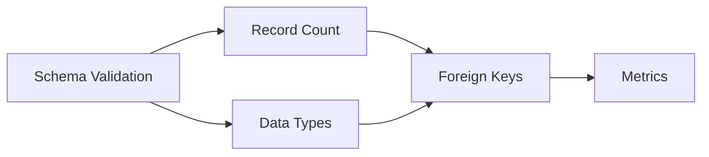

**Version**: 1.0
**Last Updated**: 2025-12-15
**Product**: Ombudsman.AI Validation Studio

---

## Table of Contents

1. [Introduction](#introduction)
2. [Getting Started](#getting-started)
3. [User Authentication](#user-authentication)
4. [Dashboard Overview](#dashboard-overview)
5. [Project Management](#project-management)
6. [Database & Schema Mapping](#database--schema-mapping)
7. [Metadata Extraction](#metadata-extraction)
8. [Pipeline Builder](#pipeline-builder)
9. [Workload Analysis](#workload-analysis)
10. [Pipeline Execution](#pipeline-execution)
11. [Comparison Viewer](#comparison-viewer)
12. [Results Viewer](#results-viewer)
13. [User Profile Management](#user-profile-management)
14. [Best Practices](#best-practices)
15. [Troubleshooting](#troubleshooting)
16. [Glossary](#glossary)

---

## Introduction

### What is Ombudsman Validation Studio?

Ombudsman Validation Studio is an intelligent data migration validation platform designed to ensure data integrity and accuracy when migrating data between databases, particularly from SQL Server to Snowflake.

### Key Features

- **30+ Built-in Validators**: Schema, data quality, referential integrity, dimension/fact validation
- **Intelligent Query Analysis**: Automatically suggests validations based on your workload
- **Visual Pipeline Builder**: Create validation workflows with drag-and-drop simplicity
- **Comparison Viewer**: See row-by-row differences between source and target
- **Automated Mapping**: Fuzzy matching for column and table mappings
- **Project Management**: Organize validations by project

### Who Should Use This Manual?

- **Data Engineers**: Validating data migrations
- **Data Analysts**: Ensuring data quality after migration
- **QA Teams**: Testing data warehouse migrations
- **Business Users**: Reviewing validation results

---

## Getting Started

### System Requirements

**To Access Ombudsman.AI**:
- Web browser (Chrome, Firefox, Safari, Edge)
- Network access to the server (port 3000)
- Valid user credentials

**Recommended Browser**:
- Google Chrome 90+ or Firefox 88+

### First-Time Access

1. **Get the Application URL** from your administrator
   - Format: `http://server-ip:3000` or `https://your-domain.com`

2. **Open your web browser** and navigate to the URL

3. **You'll see the login screen**

---

## User Authentication

### Registering a New Account

![Registration Process]

**Step 1: Access Registration Page**
1. Click **"Don't have an account? Register"** on the login page

**Step 2: Fill in Registration Form**
- **Username**: Choose a unique username (alphanumeric, 3-20 characters)
- **Email**: Enter your email address
- **Full Name**: Your full name
- **Password**: Create a strong password (min 8 characters)
- **Confirm Password**: Re-enter your password

**Step 3: Submit Registration**
- Click **"Register"** button
- If successful, you'll be redirected to the login page

**Password Requirements**:
- Minimum 8 characters
- Mix of letters and numbers recommended
- Special characters allowed

---

### Logging In

**Step 1: Enter Credentials**
1. Enter your **username**
2. Enter your **password**

**Step 2: Click "Sign In"**
- If credentials are correct, you'll be redirected to the dashboard
- If incorrect, you'll see an error message

**Step 3: Session Management**
- Your session lasts **30 minutes** by default
- After expiry, you'll be redirected to login
- You can log out anytime from the user menu

---

### Logging Out

**Method 1: User Profile Menu**
1. Click your **username** in the top-right corner
2. Click **"Profile"**
3. Click **"Logout"** button

**Method 2: Navigation**
1. Navigate to any page with a logout option
2. Click **"Logout"**

---

## Dashboard Overview

When you first log in, you'll see the **Landing Page** with feature cards.

### Dashboard Layout

```
┌─────────────────────────────────────────────────────┐
│  Ombudsman.AI        [Username] [Profile] [Logout]  │
├─────────────────────────────────────────────────────┤
│                                                     │
│  ┌──────────────┐  ┌──────────────┐  ┌──────────┐ │
│  │   Project    │  │   Database   │  │ Metadata │ │
│  │   Manager    │  │   Mapping    │  │Extraction│ │
│  └──────────────┘  └──────────────┘  └──────────┘ │
│                                                     │
│  ┌──────────────┐  ┌──────────────┐  ┌──────────┐ │
│  │   Pipeline   │  │   Workload   │  │Comparison│ │
│  │   Builder    │  │   Analysis   │  │  Viewer  │ │
│  └──────────────┘  └──────────────┘  └──────────┘ │
│                                                     │
│  ┌──────────────┐  ┌──────────────┐                │
│  │   Results    │  │    Sample    │                │
│  │   Viewer     │  │     Data     │                │
│  └──────────────┘  └──────────────┘                │
│                                                     │
└─────────────────────────────────────────────────────┘
│  © 2025 Ombudsman.AI. All rights reserved.          │
└─────────────────────────────────────────────────────┘
```

### Feature Cards

Each card represents a major feature:

1. **Project Manager**: Create and manage validation projects
2. **Database Mapping**: Map source to target databases
3. **Metadata Extraction**: Extract database schemas
4. **Pipeline Builder**: Build validation pipelines
5. **Workload Analysis**: Analyze query workloads
6. **Comparison Viewer**: View data differences
7. **Results Viewer**: View validation results
8. **Sample Data**: Generate sample data for testing

**Click any card** to navigate to that feature.

---

## Project Management

Projects help organize your validation work. Each project contains:
- Database configurations
- Mappings
- Pipelines
- Execution results

### Creating a New Project

**Step 1: Navigate to Project Manager**
- Click **"Project Manager"** card on the dashboard

**Step 2: Click "Create New Project"**

**Step 3: Fill in Project Details**
```
Project Name: [Enter descriptive name, e.g., "Sales DW Migration"]
Description: [Optional description]
Source Database: SQL Server
Target Database: Snowflake
```

**Step 4: Configure Source Connection**
```
SQL Server Configuration:
├─ Host: [192.168.1.100]
├─ Port: [1433]
├─ Database: [SampleDW]
├─ Username: [sa]
└─ Password: [Your password]
```

**Step 5: Configure Target Connection**
```
Snowflake Configuration:
├─ Account: [xyz.us-east-1.aws]
├─ Username: [your_user]
├─ Password: [Your password]
├─ Warehouse: [COMPUTE_WH]
├─ Database: [SAMPLEDW]
└─ Schema: [PUBLIC]
```

**Step 6: Test Connections**
- Click **"Test Source Connection"**
- Click **"Test Target Connection"**
- Ensure both show ✓ Success

**Step 7: Save Project**
- Click **"Create Project"**
- You'll see a success message

---

### Selecting a Project

**Why Select a Project?**
When you select a project, all subsequent operations (mapping, pipeline building, execution) use that project's configurations.

**How to Select**:
1. Go to **Project Manager**
2. Find your project in the list
3. Click **"Select"** button
4. You'll see a green checkmark indicating it's active

**Selected Project Indicator**:
- The active project name appears in the header
- All pages show which project you're working on

---

### Editing a Project

**Step 1: Open Project Manager**

**Step 2: Click "Edit"** on the project you want to modify

**Step 3: Update Fields**
- Modify project name, description, or connection details

**Step 4: Test Connections** (if you changed them)

**Step 5: Save Changes**
- Click **"Update Project"**

---

### Deleting a Project

⚠️ **Warning**: This permanently deletes the project and all associated data!

**Step 1: Open Project Manager**

**Step 2: Click "Delete"** on the project

**Step 3: Confirm Deletion**
- A confirmation dialog appears
- Click **"Confirm"** to proceed

**What Gets Deleted**:
- Project configuration
- All mappings
- All pipelines
- All execution results

---

## Database & Schema Mapping

Mappings define how tables and columns in the source database correspond to the target database.

### Why Mapping is Important

Mapping is required for:
- Automated validation generation
- Intelligent query suggestions
- Correct data comparison

### Accessing Database Mapping

**Step 1: Ensure a project is selected**

**Step 2: Click "Database Mapping"** from the dashboard

**Step 3: You'll see three tabs**:
- **Schema Mapping**: Map schemas
- **Table Mapping**: Map tables
- **Column Mapping**: Map columns

---

### Schema Mapping

**Purpose**: Map source schemas to target schemas

**Example**:
```
Source Schema    →    Target Schema
dbo              →    PUBLIC
staging          →    STG
```

**How to Add Schema Mapping**:
1. Click **"Add Schema Mapping"**
2. Select **Source Schema** from dropdown
3. Select **Target Schema** from dropdown
4. Click **"Add"**

**How to Remove Schema Mapping**:
- Click the **X** icon next to the mapping

---

### Table Mapping

**Purpose**: Map source tables to target tables

**Example**:
```
Source                    →    Target
dbo.DimCustomer          →    PUBLIC.DIM_CUSTOMER
dbo.FactSales            →    PUBLIC.FACT_SALES
```

**How to Add Table Mapping**:

1. **Manual Mapping**:
   - Click **"Add Table Mapping"**
   - Select source schema
   - Select source table
   - Select target schema
   - Select target table
   - Click **"Add"**

2. **Auto-Mapping** (Recommended):
   - Click **"Auto-Map Tables"**
   - System uses fuzzy matching to suggest mappings
   - Review suggestions
   - Click **"Accept"** on suggestions you want
   - Manually add any missing mappings

**Fuzzy Matching**:
The system automatically matches similar table names:
- `DimCustomer` matches `DIM_CUSTOMER` (95% confidence)
- `FactSales` matches `FACT_SALES` (98% confidence)

---

### Column Mapping

**Purpose**: Map individual columns between tables

**Example**:
```
Source Table: dbo.DimCustomer
Source Column              →    Target Column
CustomerID                →    CUSTOMER_ID
CustomerName              →    CUSTOMER_NAME
EmailAddress              →    EMAIL
```

**How to Add Column Mapping**:

1. **Select a table pair** from the dropdown

2. **Manual Mapping**:
   - Click **"Add Column Mapping"**
   - Select source column
   - Select target column
   - Click **"Add"**

3. **Auto-Mapping** (Recommended):
   - Click **"Auto-Map Columns"** for the table
   - System suggests matches based on:
     - Name similarity
     - Data type compatibility
     - Position in table
   - Review suggestions
   - Accept or reject each suggestion

**Mapping Confidence Levels**:
- 🟢 **Green (90-100%)**: High confidence, likely correct
- 🟡 **Yellow (70-89%)**: Medium confidence, review recommended
- 🔴 **Red (Below 70%)**: Low confidence, manual review required

---

### Saving Mappings

**Important**: Always save your mappings!

**Step 1: Click "Save Project"**

**Step 2: Verify Save**
- You'll see "Last updated: [timestamp]"

**Step 3: Navigate Away**
- Your mappings are now persisted

---

## Metadata Extraction

Metadata extraction retrieves schema information from your databases.

### What is Metadata?

Metadata includes:
- Table names
- Column names
- Data types
- Nullability
- Primary keys
- Foreign keys
- Indexes

### Why Extract Metadata?

Metadata is used for:
- Validating schema compatibility
- Generating mapping suggestions
- Building intelligent validation pipelines
- Understanding database structure

---

### Extracting Metadata

**Step 1: Ensure a project is selected**

**Step 2: Navigate to "Metadata Extraction"**

**Step 3: Choose Extraction Type**

**Option A: Extract All Metadata**
1. Click **"Extract Source Metadata"**
2. System extracts all tables and columns from source database
3. Wait for completion (10-60 seconds depending on database size)
4. Click **"Extract Target Metadata"**
5. System extracts from target database

**Option B: Extract Specific Tables**
1. Select **"Specific Tables"** mode
2. Choose tables from dropdown
3. Click **"Extract Selected"**

---

### Viewing Extracted Metadata

**Metadata View**:
```
┌─────────────────────────────────────────────────┐
│ Source Database: SampleDW                       │
├─────────────────────────────────────────────────┤
│ Tables Found: 25                                │
│                                                 │
│ Table Name          | Columns | Rows (Est)     │
│ ────────────────────┼─────────┼────────────    │
│ dbo.DimCustomer     | 12      | 50,000         │
│ dbo.DimProduct      | 8       | 5,000          │
│ dbo.FactSales       | 15      | 1,000,000      │
│ ...                                             │
└─────────────────────────────────────────────────┘
```

**Click on a table** to see column details:
```
┌─────────────────────────────────────────────────┐
│ Table: dbo.DimCustomer                          │
├─────────────────────────────────────────────────┤
│ Column          | Type      | Nullable | PK    │
│ ────────────────┼───────────┼──────────┼────── │
│ CustomerID      | INT       | No       | Yes   │
│ CustomerName    | VARCHAR   | No       | No    │
│ EmailAddress    | VARCHAR   | Yes      | No    │
│ CreatedDate     | DATETIME  | No       | No    │
│ ...                                             │
└─────────────────────────────────────────────────┘
```

---

### Extracting Relationships

**Step 1: Click "Extract Relationships"**

**Step 2: Choose Method**

**Option A: Extract from Database Constraints**
- Uses existing FK constraints in database
- 100% accurate
- Only works if FKs are defined

**Option B: Infer from Naming Patterns**
- Uses intelligent pattern matching
- Works even without FK constraints
- Shows confidence scores

**Step 3: Review Relationships**
```
Relationship Found:
FactSales.CustomerID → DimCustomer.CustomerID
Confidence: 95%
Type: Foreign Key
```

**Step 4: Accept or Reject**
- ✓ Accept relationships you want to validate
- ✗ Reject false positives

---

### Exporting Metadata

**Step 1: Click "Export Metadata"**

**Step 2: Choose Format**
- **JSON**: For programmatic use
- **YAML**: For human-readable configuration
- **CSV**: For Excel/spreadsheet import

**Step 3: Download File**

**Example YAML Export**:
```yaml
tables:
  - name: DimCustomer
    schema: dbo
    columns:
      - name: CustomerID
        type: INT
        nullable: false
        primary_key: true
      - name: CustomerName
        type: VARCHAR(100)
        nullable: false
```

---

## Pipeline Builder

The Pipeline Builder is where you create validation workflows.

### What is a Pipeline?

A pipeline is a sequence of validation steps that run in order. Think of it as a recipe for validating your data migration.

**Example Pipeline**:
```
1. Validate Schema Columns
2. Validate Record Counts
3. Validate Primary Keys
4. Validate Foreign Keys
5. Validate SUM(Amount)
```

---

### Creating a Pipeline

**Step 1: Navigate to "Pipeline Builder"**

**Step 2: Click "Create New Pipeline"**

**Step 3: Enter Pipeline Details**
```
Pipeline Name: [Sales DW Validation]
Description: [Validates sales data warehouse migration]
```

**Step 4: Add Validation Steps**

---

### Adding Validation Steps

**Method 1: Browse Step Library**

1. Click **"Add Step"**
2. Browse categories:
   - **Schema Validation**: Column existence, data types, nullability
   - **Data Quality**: Counts, nulls, uniqueness, statistics
   - **Referential Integrity**: Foreign keys
   - **Dimension Validation**: Business keys, SCD Type 1/2
   - **Fact Validation**: Fact-dimension conformance
   - **Metrics Validation**: Sums, averages, ratios
   - **Time Series**: Continuity, duplicates, drift

3. Click on a validation type
4. Configure parameters
5. Click **"Add to Pipeline"**

---

**Method 2: Use Intelligent Suggestions**

1. Click **"Get Suggestions"**
2. System analyzes:
   - Your metadata
   - Your workload (if uploaded)
   - Common patterns
3. Displays recommended validations
4. Click **"Add"** on suggestions you want

---

### Configuring Validation Steps

Each validation step has configurable parameters.

**Example: Validate Record Counts**
```
┌─────────────────────────────────────────────┐
│ Validation: Record Count Comparison         │
├─────────────────────────────────────────────┤
│ Source Table: [dbo.DimCustomer         ▼]  │
│ Target Table: [PUBLIC.DIM_CUSTOMER     ▼]  │
│ Tolerance:    [0                        ]  │
│ Description:  [Ensure row counts match  ]  │
└─────────────────────────────────────────────┘
```

**Example: Validate SUM(Column)**
```
┌─────────────────────────────────────────────┐
│ Validation: Metric Sum                      │
├─────────────────────────────────────────────┤
│ Table Pair:   [FactSales → FACT_SALES  ▼]  │
│ Column:       [Amount                   ▼]  │
│ Tolerance:    [0.01 (1%)                 ]  │
│ Description:  [Validate total sales     ]  │
└─────────────────────────────────────────────┘
```

---

### Step Dependencies

Some steps should run before others. You can define dependencies.

**Example**:
```
Step 1: Validate Schema Columns
  ↓ (must complete before)
Step 2: Validate Record Counts
  ↓ (must complete before)
Step 3: Validate SUM(Amount)
```

**How to Add Dependencies**:
1. Click on a step
2. Click **"Add Dependency"**
3. Select which step must complete first
4. Click **"Save"**

**Parallel Execution**:
Steps without dependencies run in parallel for faster execution.

---

### Visualizing Pipeline

**Step 1: Click "View Diagram"**

**Step 2: See Visual Representation**


**Benefits**:
- Understand execution order
- Identify bottlenecks
- Verify dependencies

---

### Saving Pipeline

**Step 1: Click "Save Pipeline"**

**Step 2: Verify**
- Pipeline appears in pipeline list
- You can now execute it

---

### Editing a Pipeline

**Step 1: Open Pipeline Builder**

**Step 2: Select Existing Pipeline**
- Click **"Load Pipeline"**
- Choose from list

**Step 3: Modify Steps**
- Add new steps
- Remove steps (click X)
- Edit step parameters
- Change dependencies

**Step 4: Save Changes**

---

### Deleting a Pipeline

**Step 1: Open Pipeline Builder**

**Step 2: Click "Delete Pipeline"**

**Step 3: Confirm**
- ⚠️ This deletes the pipeline definition (not results)

---

## Workload Analysis

Workload Analysis uses your actual SQL Server queries to suggest intelligent validations.

### What is Workload Analysis?

Instead of manually deciding what to validate, the system analyzes your real workload (Query Store data) and automatically suggests the most relevant validations.

**Example**:
```
Your Query:
SELECT CustomerID, SUM(Amount)
FROM FactSales
GROUP BY CustomerID

Suggested Validations:
1. Validate SUM(Amount) - Ensures totals match
2. Validate FK(CustomerID) - Ensures referential integrity
3. Validate CustomerID uniqueness in DimCustomer
```

---

### Uploading Query Store Data

**Step 1: Navigate to "Workload Analysis"**

**Step 2: Export Query Store from SQL Server**

Run this query in SQL Server:
```sql
SELECT
    qt.query_sql_text,
    qrs.count_executions,
    qrs.avg_duration,
    qrs.last_execution_time
FROM sys.query_store_query_text qt
JOIN sys.query_store_query q ON qt.query_text_id = q.query_text_id
JOIN sys.query_store_plan qp ON q.query_id = qp.query_id
JOIN sys.query_store_runtime_stats qrs ON qp.plan_id = qrs.plan_id
WHERE qrs.last_execution_time >= DATEADD(day, -30, GETDATE())
ORDER BY qrs.count_executions DESC;
```

**Step 3: Save as CSV**

**Step 4: Upload in Ombudsman**
- Click **"Upload Workload"**
- Select your CSV file
- Click **"Upload"**

---

### Analyzing Workload

**Step 1: Click "Analyze Workload"**

**Step 2: Wait for Analysis** (10-30 seconds)

**Step 3: View Results**

**Analysis Output**:
```
┌─────────────────────────────────────────────┐
│ Workload Analysis Results                   │
├─────────────────────────────────────────────┤
│ Queries Analyzed: 150                       │
│ Tables Found: 12                            │
│ Aggregations Found: 45                      │
│ JOINs Found: 78                             │
├─────────────────────────────────────────────┤
│ Intelligent Suggestions:                    │
│                                             │
│ ✓ Validate SUM(Amount) on FactSales       │
│   Reason: Found in 35 queries              │
│   Confidence: High                          │
│   [Add to Pipeline]                         │
│                                             │
│ ✓ Validate FK FactSales → DimCustomer     │
│   Reason: JOIN found in 28 queries         │
│   Confidence: High                          │
│   [Add to Pipeline]                         │
│                                             │
│ ✓ Validate AVG(Price) on DimProduct       │
│   Reason: Found in 12 queries              │
│   Confidence: Medium                        │
│   [Add to Pipeline]                         │
└─────────────────────────────────────────────┘
```

---

### Understanding Suggestions

Each suggestion includes:

**1. Validation Type**
- What will be validated (SUM, AVG, FK, etc.)

**2. Reason**
- Why this validation is recommended
- How many queries use this pattern

**3. Confidence Level**
- **High**: Found in many queries, strong pattern
- **Medium**: Found in some queries
- **Low**: Inferred from metadata

**4. Semantic Classification**
- **Identifier Columns**: CustomerID, ProductID (shouldn't be summed!)
- **Measure Columns**: Amount, Quantity (can be summed/averaged)

---

### Adding Suggestions to Pipeline

**Step 1: Review Each Suggestion**

**Step 2: Click "Add to Pipeline"** on suggestions you want

**Step 3: System Automatically**:
- Creates the validation step
- Configures parameters
- Adds to your pipeline

**Step 4: Navigate to Pipeline Builder**
- Your pipeline now has the new steps
- Save the pipeline

---

### Shape Mismatch Analysis

If source and target have different row counts, workload analysis can help identify which rows are different.

**Step 1: Click "Generate Shape Comparison"**

**Step 2: Select Table Pair**
- Choose source and target tables

**Step 3: View Mismatches**
```
Shape Mismatch Report:
├─ Source Rows: 1,000
├─ Target Rows: 998
├─ Missing in Target: 2
├─ Extra in Target: 0
└─ Mismatched Values: 5

[View Details in Comparison Viewer]
```

**Step 4: Click "View Details"**
- Opens Comparison Viewer with row-by-row differences

---

## Pipeline Execution

Once you've built a pipeline, you can execute it.

### Executing a Pipeline

**Step 1: Navigate to "Pipeline Builder"**

**Step 2: Select Pipeline**
- Choose the pipeline you want to run

**Step 3: Click "Execute Pipeline"**

**Step 4: Monitor Execution**
```
┌─────────────────────────────────────────────┐
│ Execution Progress                          │
├─────────────────────────────────────────────┤
│ Pipeline: Sales DW Validation               │
│ Started: 2025-12-15 10:30:00               │
│                                             │
│ ✓ Step 1/5: Schema Validation (2s)         │
│ ✓ Step 2/5: Record Counts (5s)             │
│ ⏳ Step 3/5: Foreign Keys (running...)      │
│ ⏸ Step 4/5: Metrics (waiting...)           │
│ ⏸ Step 5/5: Time Series (waiting...)       │
│                                             │
│ Elapsed Time: 00:00:15                      │
└─────────────────────────────────────────────┘
```

**Step 5: Execution Completes**
- You'll see a completion message
- Overall status: PASS or FAIL
- Link to view detailed results

---

### Execution Status

**During Execution**:
- ⏳ **Running**: Step is currently executing
- ⏸ **Waiting**: Step is queued (dependency not met)
- ✓ **Passed**: Step completed successfully
- ✗ **Failed**: Step found issues

**Final Status**:
- ✓ **PASS**: All steps passed
- ✗ **FAIL**: One or more steps failed
- ⚠️ **WARNING**: Some steps passed with warnings

---

### Stopping Execution

**Step 1: Click "Stop Execution"**

**Step 2: Confirm**
- Execution stops immediately
- Partial results are saved
- You can view results of completed steps

---

## Comparison Viewer

The Comparison Viewer shows row-by-row differences between source and target data.

### When to Use Comparison Viewer

Use when:
- Row counts don't match
- You need to see which specific rows are different
- You want to understand data quality issues

---

### Generating a Comparison

**Step 1: Navigate to "Comparison Viewer"**

**Step 2: Select Table Pair**
```
Source Table: [dbo.DimCustomer      ▼]
Target Table: [PUBLIC.DIM_CUSTOMER  ▼]
```

**Step 3: Choose Comparison Type**

**Option A: Full Comparison**
- Compares all rows
- Use for small tables (< 10,000 rows)

**Option B: Sampled Comparison**
- Compares a random sample
- Use for large tables
- Sample size: [1,000 rows]

**Step 4: Click "Generate Comparison"**

---

### Viewing Comparison Results

**Result Summary**:
```
┌─────────────────────────────────────────────┐
│ Comparison Results                          │
├─────────────────────────────────────────────┤
│ Source Rows: 1,000                         │
│ Target Rows: 998                           │
│                                             │
│ Status Breakdown:                           │
│ ✓ Matching Rows: 993 (99.3%)              │
│ ✗ Missing in Target: 2 (0.2%)             │
│ ✗ Extra in Target: 0 (0%)                 │
│ ⚠️ Value Mismatches: 5 (0.5%)             │
└─────────────────────────────────────────────┘
```

**Detailed View**:
```
┌────────────────────────────────────────────────────────┐
│ Row-by-Row Comparison                                  │
├────────────────────────────────────────────────────────┤
│ Status         | CustomerID | CustomerName | Email    │
├────────────────┼────────────┼──────────────┼──────────┤
│ ✓ Match        | 1          | John Smith   | j@...    │
│ ✓ Match        | 2          | Jane Doe     | jane@... │
│ ⚠️ Mismatch    | 3          | Bob Jones    | b@...    │
│   Source:                      Bob Jones                │
│   Target:                      Robert Jones             │
│ ✗ Missing      | 4          | Alice Brown  | a@...    │
│   (Not in target)                                       │
│ ✓ Match        | 5          | Charlie Day  | c@...    │
└────────────────────────────────────────────────────────┘
```

---

### Filtering Results

**Filter by Status**:
- ☑️ Show All
- ☑️ Matches Only
- ☑️ Mismatches Only
- ☑️ Missing in Target
- ☑️ Extra in Target

**Filter by Column**:
- Click column header
- Enter search term
- Results update in real-time

---

### Exporting Comparison

**Step 1: Click "Export"**

**Step 2: Choose Format**
- **CSV**: For Excel analysis
- **Excel**: Pre-formatted with colors
- **JSON**: For programmatic processing

**Step 3: Download**

**Excel Export Features**:
- ✓ Matches highlighted in green
- ✗ Mismatches highlighted in red
- Missing rows highlighted in yellow

---

## Results Viewer

The Results Viewer shows detailed execution results for pipelines.

### Accessing Results

**Method 1: After Execution**
- Click **"View Results"** after pipeline completes

**Method 2: From Results Viewer Page**
1. Navigate to **"Results Viewer"**
2. See list of all executions
3. Click on any execution to view details

---

### Execution History

**Execution List**:
```
┌─────────────────────────────────────────────────────┐
│ Execution History                                   │
├─────────────────────────────────────────────────────┤
│ Pipeline Name        | Date       | Status | Steps │
├──────────────────────┼────────────┼────────┼───────┤
│ Sales DW Validation  | 2025-12-15 | ✓ PASS | 5/5  │
│ Sales DW Validation  | 2025-12-14 | ✗ FAIL | 3/5  │
│ Product Validation   | 2025-12-13 | ✓ PASS | 8/8  │
│ Customer Validation  | 2025-12-12 | ⚠️ WARN | 4/4  │
└─────────────────────────────────────────────────────┘
```

**Click on an execution** to see details.

---

### Viewing Execution Details

**Execution Summary**:
```
┌─────────────────────────────────────────────┐
│ Execution Details                           │
├─────────────────────────────────────────────┤
│ Execution ID: exec_20251215_103000         │
│ Pipeline: Sales DW Validation               │
│ Project: Sales DW Migration                 │
│ Started: 2025-12-15 10:30:00               │
│ Completed: 2025-12-15 10:32:45             │
│ Duration: 2m 45s                            │
│ Status: ✓ PASS                             │
│                                             │
│ Steps Passed: 5/5                           │
│ Steps Failed: 0/5                           │
│ Steps Warned: 0/5                           │
└─────────────────────────────────────────────┘
```

---

### Step-by-Step Results

**Step Details**:
```
┌─────────────────────────────────────────────┐
│ Step 1: Schema Column Validation            │
├─────────────────────────────────────────────┤
│ Status: ✓ PASSED                           │
│ Duration: 2.3s                              │
│                                             │
│ Details:                                    │
│ ├─ Source Columns: 12                      │
│ ├─ Target Columns: 12                      │
│ ├─ Matching: 12/12 (100%)                  │
│ └─ Missing: 0                              │
│                                             │
│ Result: All columns present in target      │
└─────────────────────────────────────────────┘

┌─────────────────────────────────────────────┐
│ Step 2: Record Count Validation             │
├─────────────────────────────────────────────┤
│ Status: ✓ PASSED                           │
│ Duration: 5.1s                              │
│                                             │
│ Details:                                    │
│ ├─ Source Rows: 1,000,000                  │
│ ├─ Target Rows: 1,000,000                  │
│ ├─ Difference: 0                           │
│ └─ Match: Yes                              │
│                                             │
│ Result: Row counts match exactly           │
└─────────────────────────────────────────────┘

┌─────────────────────────────────────────────┐
│ Step 3: Foreign Key Validation              │
├─────────────────────────────────────────────┤
│ Status: ✗ FAILED                           │
│ Duration: 15.7s                             │
│                                             │
│ Details:                                    │
│ ├─ FK Relationship: FactSales → DimCustomer│
│ ├─ Orphaned Rows Found: 5                  │
│ ├─ Sample IDs: [10023, 10045, 10067...]   │
│ └─ Impact: 0.0005% of rows                 │
│                                             │
│ Result: ✗ 5 orphaned foreign keys found   │
│                                             │
│ Recommendation:                             │
│ Review missing CustomerIDs in DimCustomer  │
│ [View Orphaned Rows]                        │
└─────────────────────────────────────────────┘
```

---

### Understanding Results

**Step Status**:
- ✓ **PASSED**: Validation succeeded, data matches
- ✗ **FAILED**: Validation failed, issues found
- ⚠️ **WARNING**: Validation passed but with concerns
- ⏭️ **SKIPPED**: Step skipped due to dependency failure

**Failure Details**:
Each failed step shows:
- What was checked
- What was found
- Impact assessment
- Recommendations
- Links to detailed data

---

### Downloading Results

**Step 1: Click "Download Report"**

**Step 2: Choose Format**
- **PDF**: Executive summary report
- **Excel**: Detailed data with all results
- **JSON**: Raw data for integration

**PDF Report Includes**:
- Execution summary
- Step-by-step results
- Charts and graphs
- Recommendations
- Issue details

---

## User Profile Management

### Accessing Your Profile

**Step 1: Click Username** in top-right corner

**Step 2: Click "Profile"**

---

### Viewing Profile Information

**Profile Page Shows**:
```
┌─────────────────────────────────────────────┐
│ User Profile                                │
├─────────────────────────────────────────────┤
│ Username: john.smith                        │
│ Email: john.smith@company.com              │
│ Full Name: John Smith                       │
│ Role: User                                  │
│ Account Created: 2025-12-01                │
│ Last Login: 2025-12-15 10:25:00           │
└─────────────────────────────────────────────┘
```

---

### Changing Password

**Step 1: In Profile Page**
- Scroll to "Change Password" section

**Step 2: Enter Passwords**
```
Current Password: [••••••••]
New Password: [••••••••]
Confirm New Password: [••••••••]
```

**Step 3: Click "Change Password"**

**Step 4: Success**
- You'll see a confirmation message
- You'll be logged out
- Log in with new password

**Password Requirements**:
- Minimum 8 characters
- Different from current password

---

### Updating Profile Information

**Step 1: Click "Edit Profile"**

**Step 2: Update Fields**
- Email
- Full Name

**Step 3: Save Changes**

---

## Best Practices

### For Creating Projects

1. **Use Descriptive Names**
   - ✓ Good: "Sales DW Migration - Phase 1"
   - ✗ Bad: "Project1"

2. **Test Connections First**
   - Always test before saving
   - Verify both source and target

3. **Document Your Project**
   - Use the description field
   - Note any special configurations

---

### For Database Mapping

1. **Start with Auto-Mapping**
   - Let the system suggest mappings
   - Review suggestions carefully
   - Manually add edge cases

2. **Map at All Levels**
   - Schema mapping
   - Table mapping
   - Column mapping

3. **Verify Confidence Scores**
   - Accept high-confidence (90%+)
   - Review medium-confidence (70-89%)
   - Double-check low-confidence (<70%)

4. **Save Frequently**
   - Save after each major change
   - Avoid losing work

---

### For Building Pipelines

1. **Start Simple**
   - Begin with schema and count validations
   - Add complexity gradually

2. **Use Intelligent Suggestions**
   - Upload workload data
   - Let system suggest relevant validations

3. **Set Dependencies Correctly**
   - Schema checks before data checks
   - Count checks before metric checks

4. **Test on Small Data First**
   - Use sampling for large tables
   - Verify logic before full run

5. **Name Steps Clearly**
   - ✓ Good: "Validate SUM(Amount) on FactSales"
   - ✗ Bad: "Step 3"

---

### For Workload Analysis

1. **Use Recent Queries**
   - Last 30 days is ideal
   - Captures current usage patterns

2. **Include Production Workload**
   - Use actual business queries
   - Avoid test queries

3. **Review Suggestions Critically**
   - Not all suggestions may apply
   - Use business knowledge to filter

---

### For Execution

1. **Execute During Low-Usage Times**
   - Avoid peak business hours
   - Reduces load on databases

2. **Monitor Progress**
   - Watch for long-running steps
   - Cancel if necessary

3. **Review Results Immediately**
   - Address failures quickly
   - Document findings

---

### For Results Analysis

1. **Focus on Failures First**
   - Investigate failed validations
   - Use comparison viewer for details

2. **Export Results**
   - Save for documentation
   - Share with stakeholders

3. **Track Trends**
   - Compare multiple executions
   - Look for patterns

---

## Troubleshooting

### Login Issues

**Problem**: Cannot log in

**Solutions**:
1. Verify username/password are correct
2. Check if account exists (may need to register)
3. Clear browser cache and cookies
4. Try a different browser
5. Contact administrator if issue persists

---

**Problem**: Session expires too quickly

**Solution**:
- Default session timeout is 30 minutes
- Ask administrator to increase timeout in `.env` file:
  ```
  JWT_ACCESS_TOKEN_EXPIRE_MINUTES=60
  ```

---

### Connection Issues

**Problem**: Cannot connect to database

**Solutions**:
1. **Verify Connection Details**:
   - Check host/IP address
   - Check port number
   - Verify database name
   - Confirm username/password

2. **Network Issues**:
   - Ensure database is accessible from server
   - Check firewall rules
   - Verify VPN if required

3. **Test Connection**:
   - Use "Test Connection" button
   - Read error message carefully

**Common Errors**:

**Error**: "Login timeout expired"
- Database server is unreachable
- Check network connectivity

**Error**: "Login failed for user"
- Incorrect username/password
- User doesn't have access to database

**Error**: "Cannot open database"
- Database name is incorrect
- User doesn't have permission

---

### Metadata Extraction Issues

**Problem**: Metadata extraction fails

**Solutions**:
1. Check database connection
2. Verify user has SELECT permission on INFORMATION_SCHEMA
3. For large databases, try extracting specific tables

---

**Problem**: Missing tables in metadata

**Solution**:
- User may not have permission to those tables
- Ask DBA to grant SELECT permission

---

### Pipeline Execution Issues

**Problem**: Pipeline execution hangs

**Solutions**:
1. Check if database queries are running (use SQL Server Activity Monitor)
2. Look for long-running queries
3. Consider adding query timeout
4. Stop and restart execution

---

**Problem**: All validations fail

**Solutions**:
1. Verify mappings are correct
2. Check database connections
3. Review pipeline configuration
4. Look at first failure for clues

---

**Problem**: Execution is very slow

**Solutions**:
1. **Optimize Queries**:
   - Ensure tables have indexes
   - Use sampling for large tables

2. **Database Performance**:
   - Check database load
   - Run during off-peak hours

3. **Pipeline Design**:
   - Remove unnecessary validations
   - Use dependencies to optimize order

---

### UI Issues

**Problem**: Page not loading

**Solutions**:
1. Refresh browser (F5 or Ctrl+R)
2. Hard refresh (Ctrl+Shift+R)
3. Clear browser cache
4. Check browser console for errors (F12)

---

**Problem**: Changes not saving

**Solutions**:
1. Ensure you clicked "Save" button
2. Check for error messages
3. Verify you have permission
4. Try saving again

---

### Performance Issues

**Problem**: Application is slow

**Solutions**:
1. **Browser**:
   - Close unused tabs
   - Clear cache
   - Disable browser extensions

2. **Network**:
   - Check network speed
   - Ensure stable connection

3. **Server**:
   - Contact administrator
   - May need more resources

---

### Data Issues

**Problem**: Row counts don't match

**Solutions**:
1. Check if data is still migrating
2. Verify time windows match
3. Look for filters in source query
4. Use Comparison Viewer to see differences

---

**Problem**: Metrics don't match

**Solutions**:
1. Check data types (INT vs DECIMAL)
2. Look for rounding differences
3. Verify NULL handling
4. Consider timezone differences for dates

---

## Glossary

**Dimension Table**: A table containing descriptive attributes (e.g., Customer, Product)

**Fact Table**: A table containing measurable events (e.g., Sales, Orders)

**FK (Foreign Key)**: A column that references a primary key in another table

**Fuzzy Matching**: Approximate string matching to find similar names

**Mapping**: The correspondence between source and target database objects

**Metadata**: Data about data (table names, column names, data types)

**Orphaned Row**: A row with a foreign key that doesn't match any primary key

**Pipeline**: A sequence of validation steps

**Primary Key (PK)**: A unique identifier for rows in a table

**Query Store**: SQL Server feature that captures query history

**SCD (Slowly Changing Dimension)**: A dimension that tracks changes over time
- Type 1: Overwrite old values
- Type 2: Add new rows with timestamps

**Schema**: A logical grouping of database objects (like a namespace)

**Tolerance**: Acceptable difference for numeric comparisons (e.g., 1% for sums)

**Validation**: A check to ensure data integrity

**Workload**: A collection of queries executed against a database

---

## Getting Help

### In-Application Help

- **Tooltips**: Hover over 🛈 icons for quick help
- **Inline Help**: Many pages have help text
- **Examples**: Pre-filled examples show expected formats

### Documentation

- **User Manual**: This document
- **Technical Manual**: For administrators and developers
- **Architecture Guide**: System design and components

### Support

Contact your administrator or support team for:
- Account issues
- Database connection problems
- Feature requests
- Bug reports

---

**End of User Manual**

**Version**: 1.0
**Last Updated**: 2025-12-15
**© 2025 Ombudsman.AI. All rights reserved.**
