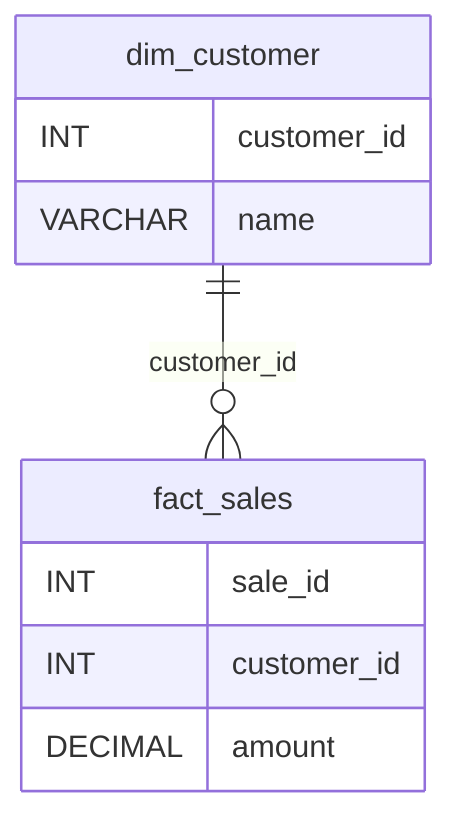

# How to View and Edit Relationships

## In the UI (Recommended)

1. **Navigate to**: http://localhost:3000
2. **Go to**: Database & Schema Mapping page
3. **Scroll down** to "Relationship Inference & ER Diagram" section
4. **Click**: "Infer Relationships" button
5. **View**:
   - 📊 Metrics dashboard
   - 📐 Mermaid ER diagram (visual)
   - 📋 Relationship table (editable list)

## Edit Relationships in UI

1. **Click**: "Edit Relationships" button
2. **Delete** incorrect relationships using trash icon
3. **Click**: "Save to YAML" button
4. Relationships saved to: `ombudsman_core/src/ombudsman/config/relationships.yaml`

## View YAML Files Directly

### Relationships YAML
```bash
# View relationships
cat ombudsman_core/src/ombudsman/config/relationships.yaml

# Example output:
# - fact_table: fact_sales
#   fk_column: customer_id
#   dim_reference: dim_customer.customer_id
# - fact_table: fact_sales
#   fk_column: product_id
#   dim_reference: dim_product.product_id
```

### Tables YAML
```bash
# View table structures
cat ombudsman_core/src/ombudsman/config/tables.yaml

# Example output:
# sql:
#   fact_sales:
#     sale_id: INT
#     customer_id: INT
#     amount: DECIMAL(18,2)
#   dim_customer:
#     customer_id: INT
#     name: VARCHAR(100)
# snow:
#   FACT_SALES:
#     SALE_ID: NUMBER
#     CUSTOMER_ID: NUMBER
#     AMOUNT: NUMBER
```

## Manual Editing (Advanced)

You can manually edit the YAML files:

```bash
# Edit relationships directly
nano ombudsman_core/src/ombudsman/config/relationships.yaml

# Format:
# - fact_table: <fact_table_name>
#   fk_column: <foreign_key_column>
#   dim_reference: <dimension_table>.<primary_key_column>
```

## Backup Location

All changes are automatically backed up:

```bash
ls -lh ombudsman_core/src/ombudsman/config/backups/

# Example:
# relationships.yaml.20251129_125647
# tables.yaml.20251129_125647
```

## Restore from Backup

```bash
# Restore relationships from backup
cp ombudsman_core/src/ombudsman/config/backups/relationships.yaml.20251129_125647 \
   ombudsman_core/src/ombudsman/config/relationships.yaml
```

## Mermaid Diagram Syntax

The system generates Mermaid ERD syntax. You can also view/edit it:



Legend:
- `||--o{` = One-to-many relationship (solid line = high confidence)
- `||..o{` = One-to-many relationship (dotted line = medium confidence)
- `}|..|{` = Weak relationship (low confidence)
- `||--x{` = Broken relationship (orphaned FKs)
